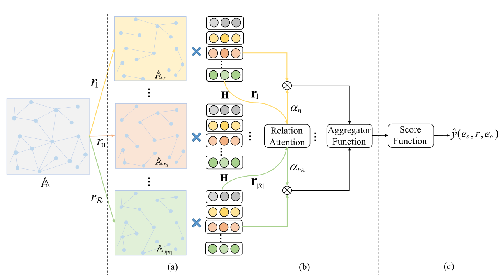

# title
[Learning Knowledge Graph Embedding With Heterogeneous Relation Attention Networks](https://www.researchgate.net/publication/349465119_Learning_Knowledge_Graph_Embedding_With_Heterogeneous_Relation_Attention_Networks)

# Abstract
KG Embedding旨在研究嵌入表示以保留KG的固有结构。
GNN作为一种有效的图表示技术，在学习图嵌入方面表现出了令人印象深刻的性能。
本文提出了一种新的基于注意机制的异构GNN框架。
- 首先在每个关系路径下聚合实体的邻居特征。
- 然后通过关系特征学习不同关系路径的重要性。
- 最后，聚集具有学习的权重值的每个基于关系路径的特征以生成嵌入表示。

因此，所提出的方法不仅从不同的语义方面聚集实体特征，而且还为它们分配适当的权重。该方法可以捕获各种类型的语义信息，并选择性地聚集信息特征。
# Conclusion
在本文中，为了捕获异构KG中的复杂结构和丰富语义，提出了**异构关系注意网络（heterogeneous relation attention networks, HRAN）**。HRAN通过关系路径分别聚集相邻特征。同时，通过注意机制学习每个关系路径的重要性，利用注意机制选择性地聚集信息特征。对于三元组预测，提出了生成关系特定滤波器的ConvD。然后，从每个实体中，可以在卷积运算期间提取特定于关系的语义特征。
链路预测任务的实验结果证明了所提方法的有效性。此外，还研究了不同参数的灵敏度效应和进一步分析。对于未来的工作，由于采样有用的不正确训练示例是一项关键任务，因此可以利用最新的生成对抗网络(GAN)来生成不正确的三元组。
# Introduction
KG可以应用于推荐系统、信息检索以及问答等。
因为KG的不完整性，研究人员将注意力转向了链接预测，它试图预测KG中缺失的事实。现有的链接预测(link prediction, 下文称LP)方法被认为是KG嵌入（KGE）。然后利用嵌入来促进后续LP任务。
先前的KGE方法没有考虑structure enforcement和incorporate connectivity structure。
GNN可以有效地聚集每个节点的局部信息。
- GNN可以利用与节点相关联的邻居特征。
- 通过采用相同的聚集函数，可以提高卷积计算的学习效率。

然而，KG通常具有多种类型的实体和关系，这些实体和关系被广泛称为异构信息网络。可以观察到，在每个基于关系的三元组下，实体显示出不同的语义特征。由于异构图的复杂性，传统的GNN方法不能直接应用于KG。因此，在设计KGs的有效GNN架构时，必须考虑以下问题：
## A. Heterogeneity of KG
KG具有异质性的固有属性，其中各种类型的实体具有各种属性，其特征可能属于不同的嵌入空间。处理复杂的结构图数据并同时保留多个特征信息是一个紧迫的问题。
## B. Importance of relation
KG的异质性通常由关系路径反映，该关系路径展示了涉及不同三元组的复杂语义特征。因此可以通过不同的关系路径聚合不同的语义特征。如何合并这些语义特征并选择最有意义的关系路径是一个关键问题。
平等对待不同的关系路径是不切实际的，这将削弱一些重要关系路径聚集的语义特征。因此，应该了解每个关系路径的重要性，并为它们分配适当的权重。
## C. Influence of Aggregator
实体通过聚合函数(aggregator function，下称AF)融合每个关系路径的相邻特征。AF是GNN架构的关键组件。
与欧几里得空间（例如图像、句子和视频）上的深度学习不同，图结构数据通常没有规则序列。因此，AF应该在一组无序的特征向量上运行。同时，在神经网络训练过程中，它需要具有可训练性并保持较高的计算效率。有许多有效的AF，因此需要研究由不同AF组成的GNN架构对性能的影响。
***
基于以上分析，本文提出了一种新的学习KGE的异构关系注意网络框架，称为HRAN。

本文工作:
1. 提出了HRAN框架。具体而言，HRAN通过关系路径融合每种类型的语义特定信息。它可以以分层方式聚集相邻特征，同时保留不同的特征信息。
2. 注意机制用于学习每个关系路径的重要性。基于学习到的注意值，该方法可以选择性地聚集信息特征并抑制无用特征。此外，HRAN采用了三种有效的聚合函数来降低方差和计算复杂度，可应用于大规模异构图。
3. 进行了大量实验来评估所提出方法的性能。通过与现有方法的比较，结果显示了HRAN的优越性。更重要的是，通过分析注意机制的影响，所提出的HRAN展示了其对实验结果的潜在优势。
# method
HRAN遵循一个层次结构，包括实体级聚合、关系级聚合和三元组预测。在介绍HRAN框架之前，总结了链路预测和图卷积的基本概念。本文中使用的主要符号如下表所示。
$$
\begin{array}{cc}
\hline \text { Notations } & \text { Explanations } \\
\hline \mathcal{G} & \text { KG } \\
\mathcal{E}, \mathcal{R}, \mathcal{T} & \text { 实体集合，关系集合，三元组集合 } \\
\mathbb{A} / \mathbf{A} & \text { 邻接矩阵 } \\
\mathbf{h}_{e}^{0} / \mathbf{r}_{r}^{0} & \text { 初始嵌入 } \\
\mathcal{N}_{(e)}^{r} & \text { 基于节点的关系路径 } \\
\mathbf{W} & \text { 权重变换矩阵 } \\
\mathbf{q} & \text { 关系的注意力向量 } \\
\alpha_{r} & \text { 关系路径权重 } \\
\beta & \text { 自注意力权重 } \\
\mathbf{E}, \mathbf{R} & \text { 实体与关系的嵌入 } \\
e_{s}, r, e_{o} & \text { 头，关系，尾 } \\
\mathbf{e}_{s}, \mathbf{r}, \mathbf{e}_{o} & \text { 分别对应的嵌入向量 } \\
\varphi(x) & \text { 打分函数 } \\
\hat{y}(x) & \text { 三元组预测概率 } \\
\hline
\end{array}
$$
## A. Preliminaries
1. LP: 给定具有特定关系的实体，链接预测旨在预测能够组成正确三元组的另一个合适实体，即通过$(e_s, r)$预测$e_o$。对于每一个三元组，通过定义一个得分函数$\varphi(e_s,r,e_o)\in R$的一般方法来实现这一目标。优化的目标通常是使正确的三元组得分高于不正确的三元组。
2. Graph Convolution(GC): 在本文中，GC被用来聚集节点特征，并以端到端的方式为链路预测任务生成嵌入。设$\mathbf{H}^{(l)}$表示GNN中第$l$层的节点特征矩阵，前向传播可以写成:
   $$\mathbf{H}^{(l)}=f\left(\tilde{\mathbf{D}}^{-\frac{1}{2}} \tilde{\mathbf{A}} \tilde{\mathbf{D}}^{-\frac{1}{2}} \mathbf{H}^{(l-1)} \mathbf{W}^{(l)}\right)$$其中：
   - $\tilde{\mathbf{A}}=(\mathbf{A}+\mathbf{I}) \in \mathbb{R}^{|\mathcal{E}| \times|\mathcal{E}|}$因为其中包括了自连接(self-connections)
   - $\tilde{\mathbf{D}}_{i i}=\sum_{j} \tilde{\mathbf{A}}_{i j}$，表示度矩阵
   - $\mathbf{W}^{(l)} \in \mathbb{R}^{d^{(l-1)} \times d^{(l)}}$，特定层的权重矩阵

   对于有向图,A不对称，可以通过逆对角矩阵进行标准化处理:$$\mathbf{H}^{(l)}=f\left(\tilde{\mathbf{D}}^{-1} \tilde{\mathbf{A}} \mathbf{H}^{(l-1)} \mathbf{W}^{(l)}\right) .$$
***
可以观察到，上述卷积运算被用于处理同构图结构数据。
由于关系和基于关系路径的实体是KG中的两个基本元素，因此有必要为异构图形数据创建一个新的GNN框架，以捕捉它们的内在差异。
## B. Entity-Level Aggregation

由于KG的异质性，不同类型的实体可能出现在不同的特征空间中。直接聚合每个实体的所有相邻特征是不合适的。因此，提出了实体级聚合，首先聚合每个基于关系路径的实体特征。
聚合函数：$$\mathbf{h}_{\mathcal{N}_{(e)}^{r}}^{(l-1)}=\Phi_{\mathrm{agg}}\left(\left\{\mathbf{h}_{i}^{(l-1)} \forall i \in \mathcal{N}_{(e)}^{r}\right\}\right) \quad \forall r \in \mathcal{R}$$该公式见文知意，$\Phi_{\mathrm{agg}}$可以用均值聚合，因此该公式可以写为：$$\mathbf{h}_{\mathcal{N}_{(e)}^{r}}^{(l-1)}=\frac{1}{\left|\mathcal{N}_{(e)}^{r}\right|}\left(\sum_{i \in \mathcal{N}_{(e)}^{r}} \mathbf{h}_{i}^{(l-1)}\right) \quad \forall r \in \mathcal{R}$$
因此对于每个节点，都有$|\mathcal{R}|$个聚合特征:$\left\{\mathbf{h}_{\mathcal{N}_{(e)}^{r_1}}^{(l-1)}, \mathbf{h}_{\mathcal{N}_{(e)}^{r_2}}^{(l-1)}, \ldots, \mathbf{h}_{\mathcal{N}_{(e)}^{(r_{|\mathcal{R}|})}}^{(l-1)}\right\}$

解释：出于直观的感觉，针对特定关系r，$e_s$对于$\forall e_o^r\in N_{e_s}^r$的重视程度是一样的

## C. Relation-Level Aggregation
- 针对某一特定关系的节点有特定的语义特征
- 平等对待不同关系特征会削弱重要关系特征
- 通过基于关系路径的注意力机制捕获对于节点来说不同关系的重要性
- 聚合各种类型的语义信息(实体语义信息，上一节；关系语义，本小节)

为了学习不同关系路径的重要性，将$|\mathcal{R}|$组实体聚合特征作为输入：$$\left\{\alpha_{r_{1}}^{(l-1)}, \ldots, \alpha_{r_{|\mathcal{R}|}}^{(l-1)}\right\}=\Phi_{\text {att }}\left\{\mathbf{r}_{r_{1}}^{(l-1)}, \ldots, \mathbf{r}_{r_{|\mathcal{R}|}}^{(l-1)}\right\}$$也即$$\alpha_{r}^{(l-1)}=\Phi_{\text {att }}\left(\left\{\mathbf{r}_{r}^{(l-1)} \forall r \in \mathcal{R}\right\}\right)$$其中$\Phi_{att}$表示注意力函数，它可以捕获基于关系的重要性，并利用它选择性地聚集异构KG背后的信息特征。
为了学习每个关系路径的权重值，首先利用非线性变换（例如，一层MLP）来变换关系特定特征$\mathbf{r}_r^{(l-1)}$，然后，通过注意力向量$\mathbf{q}$测量关系特定特征的重要性。流程如下：$$\alpha_{r}^{(l-1)}=\sigma\left(\mathbf{q}^{\top} \tanh \left(\mathbf{W} \mathbf{r}_{r}^{(l-1)}+\mathbf{b}\right)\right)$$，其他参数见上表。W，b，q都是实体与关系无关的特征。不难理解，$\alpha^{(l-1)}_r$越大，$r$越重要。
在获得每个关系路径的重要性后，可以使用学习注意力权重作为系数。然后，所有基于关系路径的聚合邻居特征可以被级联和融合，以获得每个实体的最终聚合邻居特征，如下所示：$$\mathbf{h}_{\mathcal{N}_{(e)}}^{(l-1)}={\Phi_{\mathrm{agg}}}\left(\operatorname{CONCAT}\left\{\alpha_{r} \mathbf{h}_{\mathcal{N}_{(e)}^{(l)}}^{(l-1)}, \forall r \in \mathcal{R}\right\}\right)$$其中CONCAT表示连接操作。由于聚合过程应该是可训练的，并在方法训练期间保持较高的计算效率，因此提出了三种有效的方法：均值/最大值/总和，如下所示：$$\mathbf{h}_{\mathcal{N}_{(e)}}^{(l-1)}=\left\{\begin{array}{l}
\frac{1}{|r|} \sum_{1}^{d} \sum_{\forall r \in \mathcal{R}}\left(\alpha_{r} \mathbf{h}_{\mathcal{N}_{(e)}^{r}}^{(l-1)}\right) \\
\max \left(\operatorname{CONCAT}\left\{\alpha_{r} \mathbf{h}_{\mathcal{N}_{(e)}^{r}}^{(l-1)} \forall r \in \mathcal{R}\right\}\right) \\
\sum_{1}^{d} \sum_{\forall r \in \mathcal{R}}\left(\alpha_{r} \mathbf{h}_{\mathcal{N}_{(e)}^{r}}^{(l-1)}\right)
\end{array}\right.$$d表示d维特征。这里的均值和求和聚合函数为何要累加d次？总和聚合器近似类似于GCN框架中使用的AF。均值和最大聚合器受CNN中的池方法的启发。然后，可以通过非线性变换将图卷积传播更新为：$$\left\{\begin{array}{l}
\mathbf{h}_{e}^{(l)}=f\left(\mathbf{W}_{e}^{(l)} \mathbf{h}_{\mathcal{N}_{(e)}}^{(l-1)}\right) \\
\mathbf{r}_{r}^{(l)}=f\left(\mathbf{W}_{r}^{(l)} \mathbf{r}_{r}^{(l-1)}\right)
\end{array}\right.$$其中$f()$是ReLU函数。**注意**，上述的$\mathbf{h}_{\mathcal{N}_{(e)}}^{(l-1)}$并没有节点的本身信息，因此需要在GCN中加入自环传播，于是引入了超参数$β$，称为自注意系数。所以实体嵌入传播改写为：$$\mathbf{h}_{e}^{(l)}=f\left(\mathbf{W}_{e}^{(l)}\left((1-\beta) \mathbf{h}_{\mathcal{N}_{(e)}}^{(l-1)}+\beta \mathbf{h}_{e}^{(l-1)}\right)\right)$$$β$确定实体特征本身在自循环中的保留率。最后，通过特征的连接得到嵌入矩阵:$$\left\{\begin{array}{l}
\mathbf{E}=\operatorname{CONCAT}\left\{\mathbf{h}_{e}^{(L)} \forall e \in \mathcal{E}\right\} \\
\mathbf{R}=\operatorname{CONCAT}\left\{\mathbf{r}_{r}^{(L)} \forall r \in \mathcal{R}\right\}
\end{array}\right.$$与以往基于GCN的方法相比，所提出的实体级聚合和关系级聚合可以通过不同的关系路径聚合来自不同语义方面的实体特征。此外，注意机制用于基于重要关系路径选择性地聚集信息特征。整个过程如算法1所示。

## D. Triplet Prediction
对于三重预测，为了处理KG中的多个关系类别，引入了一种新的基于CNN的评分函数，称为**卷积动态神经网络（Convolution dynamic neural networks, ConvD）**。它为每个基于关系的三元组生成特定于关系的过滤器。然后，可以提取每个主题实体在具有不同关系的三元组中的特定关系语义特征，然后用于与对象实体的预测。它可以有效地提高方法的泛化能力。
对于输入$(e_s, r, r_o)$，首先从嵌入矩阵获得嵌入向量:$$\mathbf{e}_{s}=\mathbf{x}_{e_{s}}^{\top} \mathbf{E}, \quad \mathbf{r}=\mathbf{x}_{r}^{\top} \mathrm{R}, \quad \text { and } \mathbf{e}_{o}=\mathbf{x}_{e_{o}}^{\top} \mathbf{E}$$其中的x是one-hot向量。CNN的输入可以为:$$\mathbf{M}=\operatorname{CONCAT}\left\{\mathbf{e}_{s}, \mathbf{r}\right\}$$然后进行卷积操作，一个提供N个核:$$\Omega_{r}=\left[\Omega_{r}^{1}, \Omega_{r}^{2}, \ldots, \Omega_{r}^{N}\right] \in \mathbb{R}^{N \times h \times w}  $$并生成特征图  $$\mathbf{V}=\left[\mathbf{v}_{1}, \mathbf{v}_{2}, \ldots, \mathbf{v}_{N}\right] \in   \mathbb{R}^{N \times H \times W}$$，计算(卷积)过程如下:$$\mathbf{v}_{n}(i, j)=\left(\mathbf{M} \star \Omega_{r}^{n}\right)(i, j)=\sum_{a=1}^{h} \sum_{b=1}^{w} \mathbf{M}(i+a, j+b) \Omega_{r}^{n}(a, b)$$
在对关联对象实体进行预测时，将输出的特征映射扁平化，投影到一个包含关联$e_s$和$r$的d维向量上，然后建立评分函数:$$\varphi\left(e_{s}, r, e_{o}\right)=f((\operatorname{vec}(f(\mathbf{V})) \mathbf{W})) \mathbf{e}_{o}$$，结合V的计算过程，可以得到:$$\varphi(e_{s},r,e_{o})=f(\mathrm{vec}(f({\mathrm{CONCAT}}\{\mathbf{e}_{s},{\mathbf{r}}\}\star\Omega_{r})){\bf W})\mathbf{e}_{o}.$$最后通过概率函数得到对应预测的三元组的可能性：$$\hat{y}(e_{s},r,e_{o})=sigmoid(\varphi(e_{s},r,e_{o})+\mathcal{0})\in(0,1)$$与之前的方法采用共享过滤器不同，
ConvD旨在生成关系特定(动态)过滤器，从而从嵌入的主体实体中提取关系特定的特征。ConvD的训练过程如图2所示。
## E. Training Objective
似然函数：$$p({\mathcal G}|\Theta)=\prod_{\substack{(e_s,r,e_{o})\in T \\ {(e_{s},r,e_{o}^{\prime})\in T^{\prime}}}}(\hat{y}(e_{s},r,e_{o}))^{y}(1-\hat{y}(e_{s},r,e_{o}^{\prime}))^{1-y}$$
优化目标:
$$
\begin{aligned}
min\mathcal{L} &= -log\ p({\mathcal G}|\Theta) \\
 &=-\sum_{\substack{(e_s,r,e_{o})\in T \\ {(e_{s},r,e_{o}^{\prime})\in T^{\prime}}}}
(
    y\ log\ \hat{y}(e_s, r, e_o) +
    (1-y)log(1-\hat{y}(e_{s},r,e_{o}^{\prime}))
)
\end{aligned}
$$

在训练过程中使用dropout技术对HRAN进行了正则化。每一层之后都采用批量归一化(batch_normal)来稳定、正则化，提高收敛速度。利用标签平滑(label smoothing)来减少过拟合，提高泛化效果。采用Adam optimizer对损失函数进行优化，这是一种快速、计算效率高的梯度优化工具。