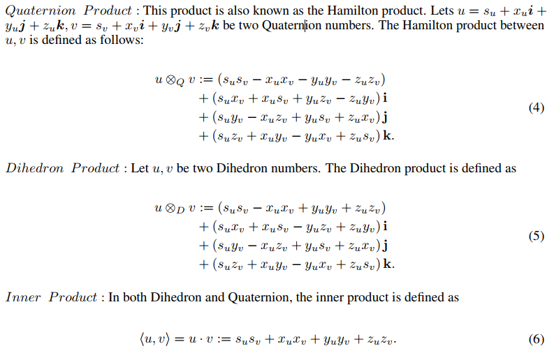
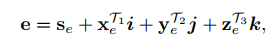
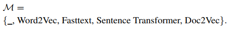
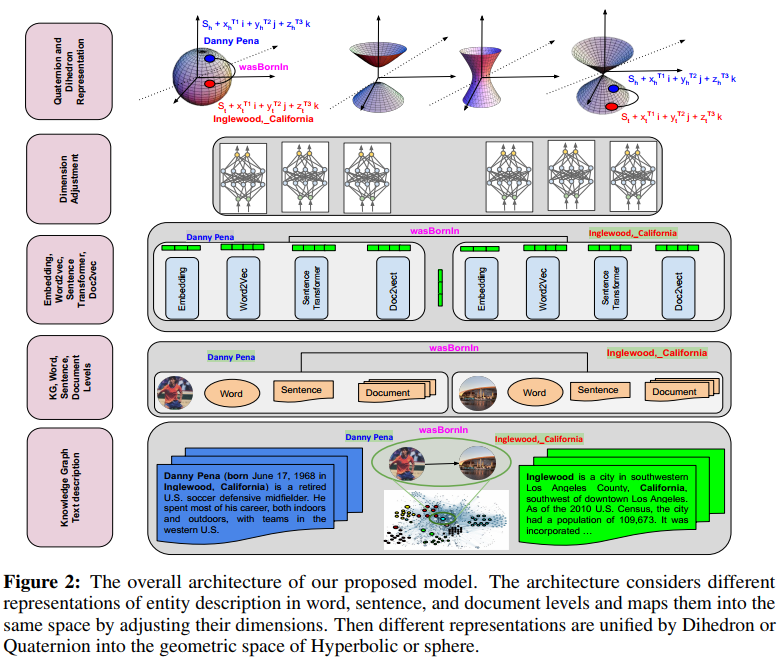

# title

[Integrating Knowledge Graph embedding and pretrained Language Models in Hypercomplex Spaces](https://arxiv.org/pdf/2208.02743.pdf)

# Abstract

图形嵌入(KGE)和语言模型(PLM)的专用方法都可以学习允许预测新结构知识的模式。很少有方法将学习和推理与这两种模式结合起来，而现有的方法只能部分利用结构知识和文本知识的相互作用。在我们的方法中，我们建立在单一模态的现有强大表示之上，并使用超复杂代数来表示（i）单一模态嵌入以及（ii）不同模态之间的相互作用及其知识表示的补充手段。
更具体地说，我们建议4D超复数的二面体和四元数表示法，以集成四种模式，即结构知识图嵌入、单词级表示（例如Word2vec、Fasttext）、句子级表示（句子转换器）和文档级表示（句句转换器，Doc2vec）。我们的统一矢量表示通过Hamilton和二面体乘积对标记边的合理性进行评分，从而对不同模式之间的成对相互作用进行建模。

# Conclusion

在这项工作中，我们通过合并多个PLM，利用实体描述和名称中不同级别的语义信息来增强KGE模型。为了将不同的语义信息与实体嵌入相结合，我们借助超复数提出了一个统一的框架。我们还讨论了在此框架下的几种烧蚀模型。广泛的实验结果、消融研究和分析表明，我们的框架有效地利用了不同层次的语义信息和结构知识，并优于其他KGE模型。

# Introduction

以前的工作，如DKRL和ConMask，都是KGE模型的一部分，它们超越了结构图知识，还包含了用于链接预测的文本信息。这些模型采用卷积神经网络（CNN）和注意机制等深度学习方法将文本信息映射到KGE的同一空间。因此，链接预测任务同时利用了KGE的结构信息和文本的语义信息。然而，这些模型无法从最近的预处理语言模型（如BERT）中受益。

另一系列工作提出了将预处理语言模型纳入KGE模型的不同方法。它们提供了不同的方法，通过统一每个模型的两个损失函数来合并KGE和Masked语言模型。虽然有效，但上述考虑预处理语言模型的工作仅侧重于单一表示（例如，单词表示）和单一预处理语言模式（例如，Word2Vec）。然而，将文本信息的各种表示形式（例如，针对单词、句子和文档嵌入的不同预处理语言模型捕获的同一文本的各种特征）与结构信息结合起来，可以进一步提高KGE模型的性能。这种集成需要复杂的数学工具来有效地建模所有表示及其成对关联。

在本文中，我们使用一个超复数的4D空间来将KG和文本中的知识集成到一个统一的表示中。我们首先利用各种预处理语言模型来提取在超复杂空间中集成知识图嵌入和预处理语言模型——实体描述的不同层次表示。然后，我们将这些文本信息表示与KGE的结构信息相结合，以获得超复杂空间中每个实体的丰富而统一的4D表示。具体来说，我们使用二面体和四元数作为4D超复空间来统一表示所有上述表示。最后，我们对各种数据集进行了富有成效的实验、消融研究和分析，以确认将不同的预处理语言模型合并到KGE模型中的优势。

# Preliminaries
$\mathbf{Knowledge\ Graph}$
$\mathcal{Textual}\ \mathbf{Knowledge\ Graph}$: KG中关于节点/关系的文本表示。
$\mathbf{Knowledge\ Graph\ Embedding}$
$\mathbf{Pretrained\ Language\ Model\ KG\ Embedding}$: 使用预训练语言模型，如Bert、GPT等进行KGE工作。
$\mathbf{Quaternion\ and\ Dihedron\ Algebra}$: 为了将一个实体或关系的图形、单词、句子和文档表示集成到一个统一的表示中，我们需要一个在超复数领域已经得到很好研究的4D代数。特别是，我们将四元数Q和二面体D代数作为4D超复数，定义如下u=s+xi+yj+zk，其中i、j、k是三个虚部。在四元数表示中，我们有:$$\begin{array}{l}
i^{2}=j^{2}=k^{2}=i j k=\overline{1}, i j=k, j k=i, k i=j \\
j i=\bar{k}, k j=\bar{i}, i k=\bar{j}
\end{array}$$
在二面体表示中:$$\begin{array}{l}
i^{2}=\overline{1}, j^{2}=k^{2}=1, i j=k, j k=\bar{i}, k i=j \\
j i=\bar{k}, k j=i, i k=\bar{j}
\end{array}$$
$\mathbf{Quaternion Product}$: 也称为Hamilton积，

# Method

## Entity Representation

模型可以从如下选择: 

*关系表示*：$$\mathbf{r}=\frac{\mathbf{s}_{r}+\mathbf{x}_{r}^{\mathcal{T}_{1}} i+\mathbf{y}_{r}^{\mathcal{T}_{2}} j+\mathbf{z}_{r}^{\mathcal{T}_{3}} k}{\sqrt{\mathbf{s}_{r}^{2}+\mathbf{x}_{r}^{\mathcal{T}_{1}^{2}}+\mathbf{y}_{r}^{\mathcal{T}_{2}^{2}}+\mathbf{z}_{r}^{\mathcal{T}_{3}^{2}}}} .$$

*Text-Enhanced Relational RotAtion(Tetra)*: 该模型通过四个部分表示每个实体，即从KG结构$s_h$中学习的嵌入，以及通过M中的三个模型从实体的文本描述（单词、句子和文档）中学习的部分$(x_h^{T_2}, y_h^{T_3}, z_h^{T_1})$。该模型通过在二面体或四元数空间中提供头部的关系特定旋转来计算查询。⊗ 指四元数和二面体空间的Hamilton或二面体乘积。根据等式5和4，获得的查询$(x_h^{T_2}, y_h^{T_3}, z_h^{T_1})$内在地包含每个$s_h$之间的成对相关性；并为相应的查询提供了丰富的特征表示（子特征的混合）。图2显示了此模型的表示。

*Text-RelatiOn-Based RotatIon and TranslatioN(Robin)*:在这个模型中，我们将嵌入由l索引的实体名称（例如“Berlin”）和嵌入由t索引的文本描述合并在一起。我们通过这两个信息源执行旋转$\boldsymbol{h}_{l t}^{\bigtriangleup \mathcal{T_1} }$和平移$\boldsymbol{h}_{l}^{\mathcal{T}_{2} }+\boldsymbol{h}_{t}^{\mathcal{T}_{3} }+\boldsymbol{r}$。我们使用来自M的两个不同的单词嵌入和语言模型（详见实验部分）来嵌入名称和文本描述。因此，通过考虑四元数或二面体空间中的平移和旋转，通过从KG嵌入头实体、关系嵌入、实体名称和描述来计算查询。将平移和旋转结合在一起可以提高模型的表达能力，从而学习比单个旋转更复杂的结构。
*Language model-RelatIon ROtation and TranslatioN(Lion)*: 在这个模型中，对于实体的相同文本描述，我们使用两个语言/单词嵌入模型（索引为l）来嵌入相同的描述。我们使用描述嵌入作为二面体或四元数空间中查询表示的平移和旋转。
