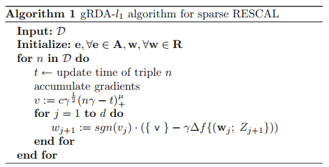

[toc]

# title

[Regularized online tensor factorization for sparse knowledge graph embeddings](https://link.springer.com/article/10.1007/s00521-022-07796-z)

# Abstract

基于张量因子分解的嵌入模型在链路预测中获得了最优的结果。

本文建议在双线性张量因子分解模型RESCAL中引入稀疏性，以构建可解释的KG嵌入。为了克服随机梯度下降在产生稀疏解时的困难，本文使用广义正则化对偶平均在线优化算法将l1正则化添加到学习目标中。

# Conclusion

1. 本文提出了一种学习稀疏KG表示的新技术。该方法使用广义正则化对偶平均在线优化算法，并将l1正则化应用于RESCAL模型。
2. 实验表明，稀疏RESCAL在实现嵌入的高稀疏性和非负性的同时，仍具有与最新技术的竞争力。并且证明了$gRDA-l_1$可以有效地应用于RESCAL和其他张量因子分解模型。
3. 此外，在单词入侵任务中的结果表明，该模型的可解释性得到了有效提高。所开发的嵌入词具有更高的语义连贯性，人们更容易理解。未来，我们考虑将$gRDA-l_1$扩展到其他张量因子分解模型。

# Introduction

由于知识图可以表示为三阶二元张量，其中张量的每个位置表示一个事实（三元组）是真还是假，因此提出了基于张量因子分解的不同算法来推断缺失的知识。

在机器学习模型中引入稀疏性的一种常见方法是将l1正则化应用于训练过程。然而，随机梯度下降在线优化（SGD）不能产生l1正则化算子的稀疏性，这使得它成为一个非平凡的任务。为了克服这个问题，我们建议使用广义正则化对偶平均 **(generalized Regularized Dual Averaging, gRDA)** 算法，它可以在在线学习环境中生成l1正则化嵌入。本文是第一个在没有任何外部知识的情况下提出稀疏知识图嵌入（KGE）解决方案的文章。
为了进行我们的研究，我们提出了RESCAL模型，并将l1正则化子引入到应用gRDA的嵌入中。我们通过实验来评估嵌入的性能和可解释性。

- 提出了第一个稀疏线性KGE模型sRESCAL，该模型提高了可解释性，并保持了与最新技术的竞争力；
- 将在线优化算法广义正则化对偶平均法应用于未知环境并显示其有效性；
- 进行稠密KGE模型和sRESCAL之间的广泛评估和比较。

# Sparse tensor factorization

本节介绍了我们通过gRDA优化算法将l1正则化应用于RESCAL模型的方法。首先，本文介绍了背景和RESCAL模型本身，然后描述了该方法的细节。同样的技术也适用于其他KGE模型，如TuckER或DistMult

## Background

| 符号                      | 含义                                                            |
|---------------------------|---------------------------------------------------------------|
| $\mathcal{D}$             | KG中的三元组集合                                                |
| $\mathcal{(e_s, r, e_o)}$ | 任意一个三元组 $ \\ e_s, e_o\in \mathcal{E}\\ r\in \mathcal{R}$ |
| $\mathcal{R}$             | 所有关系                                                        |
| $\mathcal{E}$             | 所有实体                                                        |
| $\phi$                    | 评分函数，分数$s=\phi(e_s, r, e_o) \in \mathbb{R}$               |

## RESCAL

$\mathcal{X_k}\approx A\mathbf{R_k}A^T$, A是嵌入矩阵，$R_k$是关系k的d*d矩阵, $\mathcal{X_k}$是KG的三维张亮的关于关系k的切片。
评分函数: $\phi(e_s, r, e_o) = e_s^TR_ke_o$

## Sparse RESCAL

本文的目的是通过l1正则化将稀疏性引入到嵌入中。

SGD在向量值中进行的微小更新使许多零条目的输出变得困难，即，要使两个浮点数相加并等于零是相当困难的。为了克服这个问题，本文建议使用广义正则化对偶平均（gRDA）来优化具有稀疏约束的RESCAL模型。gRDA本身是针对稀疏神经网络的RDA算法的推广，这对于使用l1正则化的稀疏在线学习非常有用，因为它可以明确地利用正则化结构。在RDA算法的每次迭代中，更新模型的权重，不仅考虑损失函数，还考虑为了实现稀疏性而引入的整个正则化项。
为了应用l1正则项，更新RESCAL的损失函数:$$\mathcal{L}_{\mathrm{sRESCAL}}=\mathcal{L}_{\mathrm{RESCAL}}+\lambda \sum_{w \in W}\{\| w\} \|_{1}$$，RESCAL模型的损失是交叉熵损失: $$\mathcal{L}_{\mathrm{RESCAL}}=-\frac{1}{n_{e}} \sum_{i=1}^{n_{e}}\left\{\left(\mathbf{y}^{i} \log \left\{\left(\mathbf{p}^{i}\right\}\right)+\left\{\left(1-\mathbf{y}^{i}\right\}\right) \log \left\{\left(1-\mathbf{p}^{i}\right\}\right)\right\}\right)$$

## Optimization

在gRDA中，每次迭代时，通过求解一个简单的优化问题来调整学习权重，该问题涉及损失函数所有过去次梯度的运行平均值。其更新规则如下：$$\begin{aligned}
\mathbf{w}_{n+1}=& \underset{\mathbf{w} \in \mathbb{R}^{d}}{\arg \min }\left\{\mathrm{w}^{T}\left\{\left(-\mathrm{w}_{0}+\gamma \sum_{1=0}^{\mathrm{n}} \Delta \mathrm{f}\left\{\left(\mathrm{w}_{\mathrm{i}} ; \mathrm{Z}_{\mathrm{i}+1}\right\}\right)\right\}\right)\right.+g\{(n, \gamma\}) \mathcal{P}(\mathrm{w})+F(\mathrm{w})\}
\end{aligned}$$
式中，$\gamma$是步长，$P(w)$是惩罚函数，$F(w)$是一个确定性和凸正则化子，$g\{(n,\gamma)\}$是n的确定性非负函数；RDA是gRDA的特例，其中$g\{(n,\gamma)\}=n\gamma$以及$w_0=0$
为了在gRDA中引入$l_1$正则项，应用: $$F(\mathbf{w})=   \frac{1}{2}\{\| \mathbf{w}\} \|_{2}^{2}\\\mathcal{P}(\mathbf{w})=\{\| w\} \|_{1}\\g(n, \gamma)=c \gamma^{\frac{1}{2}}\left(n \gamma-t_{0}\right)_{+}^{\mu}$$
根据gRDA的随机镜像下降表示，设置了如上的$F(w)$，可以使用闭合形式的近端算子$g(n,\lambda)P(w)$，有$$\Delta \Psi_{n, \gamma, j}^{*}(\mathbf{v})=\operatorname{sgn}\left(v_{j}\right) \cdot\left\{\left(\left\{\mid v_{j}\right\} \mid-g\{(n, \gamma\})\right\}\right)_{+}$$，将其作为惩罚项。
下面是算法流程:

