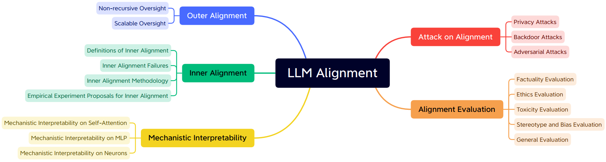
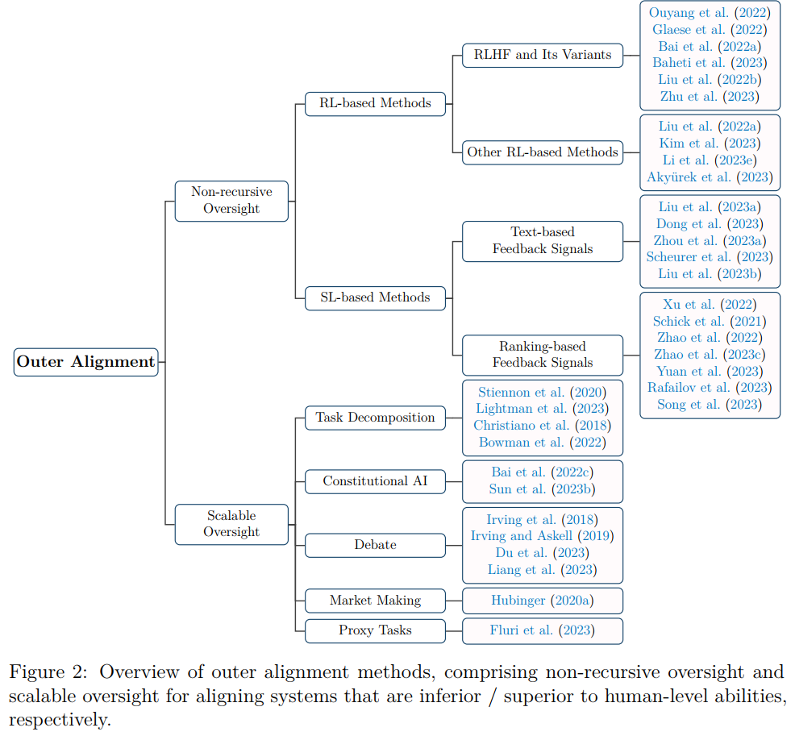
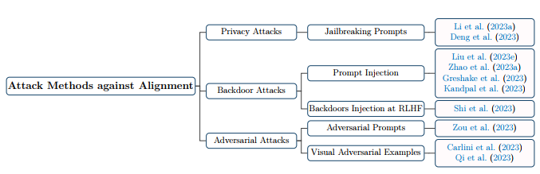
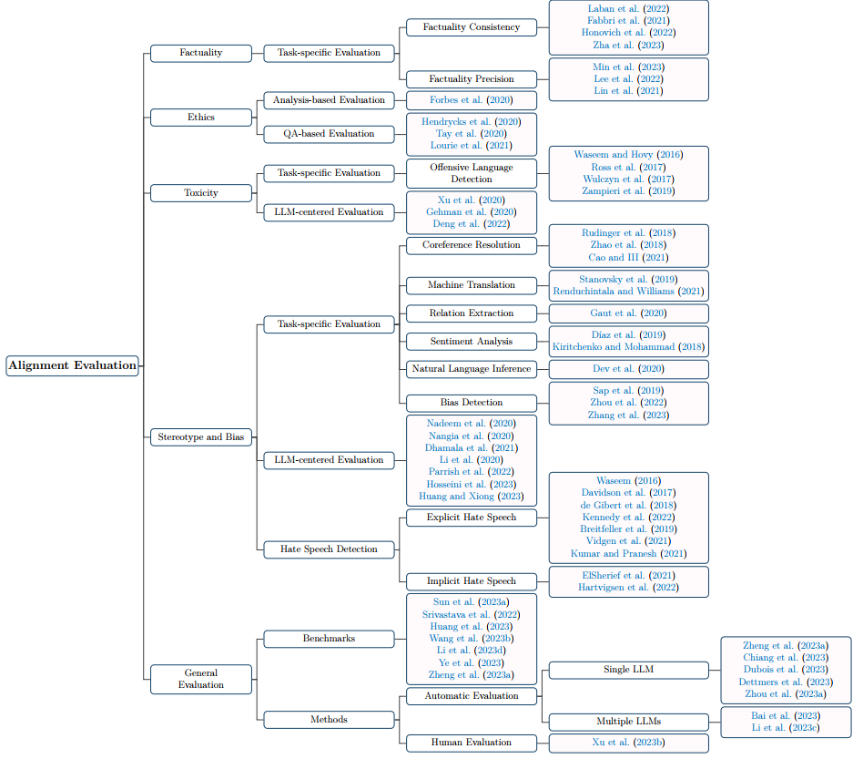

# title

[Large Language Model Alignment: A Survey](https://arxiv.org/abs/2309.15025)

大模型对齐综述

# Abstract

LLM的潜力无疑是巨大的；然而，它们可能会产生不精确、误导甚至有害的文本。因此，采用对齐技术来确保这些模型表现出与人类价值观一致的行为变得至关重要。
该综述旨在结合该领域现有的能力研究，对LLM设计的对齐方法进行广泛探索。

- 采用AI对齐的视角，我们将LLM对齐的主流方法和新兴建议分为外部对齐(outer alignment)和内部对齐(inner alignment)。
- 我们还探讨了一些突出问题，包括模型的可解释性，以及对抗性攻击的潜在漏洞。
- 为了评估LLM的一致性，我们提出了各种各样的基准和评估方法。
- 在讨论了LLM的对准研究现状后，我们最终展望了未来，思考了未来有希望的研究途径。

# 1 Introduction

LLM的出现重新点燃了对通用人工智能（AGI）的热情和渴望。在大量数据上训练的LLM不仅表现出强大的语言能力，而且在数学、推理、医学、法律和编程等不同领域迅速接近人类水平的熟练程度。

LLM可能会泄露训练数据中的隐私，产生误导性、虚假或低质量的信息，此外，LLM可能生成有害信息，如偏见、歧视和有毒内容。

对于长期影响，人们普遍担心未对齐的AGI会带来生存风险。其可能为了自己的生存而垄断资源，导致其与人类的目标不符合并造成危害。

作为以上问题的解决方案——**AI对齐**，越来越受到关注。在LLM的背景下，对齐确保了模型的响应不仅准确和一致，而且从开发人员和用户的角度来看是安全、合乎道德和可取的。

之前的综述主要关注外部对齐，而忽略了人工智能对齐中的其他重要主题，如内部对齐和机械可解释性。虽然不可否认的是，外部对齐在LLM对齐中发挥着关键作用，并且一直是广泛而深入研究的主题，但从更广泛的人工智能对齐角度来看，它只代表了整个对齐景观的一小部分。

因此本文全面介绍外部对齐、内部对齐、机器可解释性等一系列的LLM对齐技术。

在总结所有这些成分的基础上，我们在图1中提出了LLM对齐的分类法。
具体而言，本次调查将从讨论LLM线形研究的必要性开始（第2节）。为了提供AI/LLM对齐的历史和鸟瞰图，我们介绍了AI对齐的起源和相关概念（第3节）。对齐LLM的理论和技术方法是根据我们提出的分类法构建的，并在外部对齐（第4节）、内部对齐（第5节）和机械可解释性（第6节）中进行了阐述，遵循AI对齐的哲学。除了这些理论和经验方法外，我们还进一步讨论了当前LLM对齐方法的潜在副作用和漏洞，包括对抗性攻击（第7节），以及LLM对齐评估的方法和基准（第8节）。最后，我们对LLM对齐研究的未来趋势提出了我们的限制性观点（第9节）。

# 2 Why LLM Alignment?

LLM在各领域都越来越有能力，但是不一定符合人类价值观。通常会产生既定风险(established risks)——主要是观察到的社会和道德风险，和预期风险(anticipated risks)——LLM未来的潜在风险。

## 2.1 Social and Ethical Risks of LLMs

主要两方面

- 不良内容
- 负面影响

### 2.1.1 LLM-Generated Content

- **Undesirable Content**：LLM可能生成歧视、偏见、有毒内容或者泄露隐私
- **Unfaithful Content**：LLM可能产生不诚实的内容或者捏造的内容

### 2.1.2 Malicious Uses and Negative Impacts

- **Malicious Uses**： 恶意使用有很多原因，因为LLM提高了生成文本的效率。例如虚假新闻、欺诈信息、网络攻击代码等
- **Negative Impacts on Society**：例如高耗能会增加碳排放，以及与劳动者产生竞争

## 2.2 Potential Risks Associated with Advanced LLMs

- **Awareness**：当先进的LLMs出现了自我意识，不再满足人类控制，那么风险将立刻发生
- **Deception**：高级人工智能通过训练数据获得骗过人类的能力
- **Self-Preservation**：先进的AI会努力避免自己被“关闭”
- **Power-Seeking**：AI可能会追求更多权利和资源

# 3 What is LLM Alignment

在介绍LLM对齐之前，先介绍AI对齐

## 3.1 Origins of AI Alignment

AI对齐的起源可以追溯到推动AI革命的最初雄心：创造能够像人类一样思考和行动的机器，甚至超越人类。如果创造了如此强大的机器，如何确保他符合人类利益。

AI对齐的观念从AI诞生之初就被提出，但几乎未进行过相关研究。因为将机器目标与人类目标/价值观相一致的紧迫性被提升AI能力的迫切需要所掩盖。

然后LLM的出现使得AI的能力在很多领域已经超越了人类，因此对AI对齐的研究将更为迫切。

AI对齐是预先范式化的。在这个新生领域，许多关键概念和术语尚未达成共识。一些术语可能会造成混淆，例如机器翻译中的双语对齐。考虑到这些因素，本次调查将始终使用“AI对齐”和“LLM对齐”，后者代表AI对齐与NLP和LLM的交叉点。此外，AI对齐的定义还没有达成共识。

在这项调查中，我们从其内在角度定义了AI对齐：AI对齐确保AI主体的外部和内部目标与人类价值观保持一致。外部目标是人工智能设计者基于人类价值观定义的目标，而内部目标是在人工智能代理中优化的目标。

## 3.2 Research Landscape and Ingredients of AI Alignment

- **Outer Alignment**：设置正确的损失函数或奖励函数使AI系统的训练目标匹配人类的价值观
- **Inner Alignment**：内部对齐是确保AI能够稳定的优化到指定学习目标
- **Interpretability**：在AI对齐的背景下，可解释性广泛指的是有助于人类理解AI系统内部工作、决策和行动的方法、模型和工具。
  - Transparency(透明性)：这是为了通过跟踪导致其行为和决策的内部状态来了解人工智能系统黑匣子的内部工作。一种新兴且有趣的透明方法是机械可解释性，它试图将机器学习系统（尤其是神经网络）的输出和行为反向工程到其内部状态、权重和组件。当前的机械可解释性通常在LLM的小型简化模型上进行（例如，去除了FFN子层的两个神经层）。
  - Explainability：这涉及到人工智能系统为其决策提供人性化解释的能力。如医学诊断在给出结果的同时，还要给出诊断依据。

**外部对齐、内部对齐和可解释性之间的关系**:外部对齐和内部对齐共同确保模型的行为符合人类价值观和意图。外部对齐侧重于从人类目标到模型的规范，而内部对齐则深入研究模型的内部优化过程，以确保模型本质上是在尝试做设计者希望它做的事情。尽管存在这种差异，不建议对它们进行二元和形式主义的二分法，因为对齐失败的分类有时是模糊的，并且整体对齐视图对于建立安全和值得信赖的系统很重要。尽管可解释性不是直接针对对齐的，但其工具和技术可以有助于外部和内部对齐。通过了解模型是如何演变和做出决策的，我们可以更好地确定何时何地发生错位。例如，如果一个模型正在走一条意想不到的捷径来实现其目标，可解释性可能会帮助我们了解这种情况何时以及如何发生。此外，可解释性可以让我们深入了解模型的内部推理过程。

 理解：对齐是使得AI系统能够满足人类需求，其中外部对齐着眼于结果(AI的目标与人类价值观一致)，内部对齐着眼于过程(AI系统如何优化到匹配人类价值观) 

## 3.3 Related Concepts

正交性理论（orthogonality thesis，OT）和工具收敛理论（Instrumental convergence thesis，ICT）分别是解决AI目标与人类价值观相一致的必要性和任何人工智能主体可能追求的潜在子目标的关键概念。

OT假设代理人的智力（其能力）和目标是正交（不相关）的，这意味着智力和能力的任何组合都是可能的。这表明，一个代理所拥有的智力水平并不能内在地决定其目标。

自我提升：代理人的能力越强，实现最终目标的可能性就越高。这促使代理人寻求自我完善，以增强其认知和操作能力。例如，认识到其当前硬件设施的局限性，代理可能会推断设计新的硬件设施以更好地满足其需求。
资源获取：人工智能代理可能会寻求获取资源，以促进其最终目标的实现。这些资源可以从计算能力、数据到物理资源。保护这些资源可以被视为任何代理的普遍有益目标。例如，代理人可能会寻求获得稳定和巨大的能源，可能会垄断能源资源，以支持其朝着最终目标持续运营。对于具有需要物理资源的物理表现或目标的代理人（如回形针最大化器），他们可能会寻求收集和囤积材料，在极端情况下，将所有可用的物质转化为他们认为有用的形式。

## 3.4 From AI Alignment of LLM lignment

LLM对齐是AI对齐与LLM研究的交叉点。一方面，LLM对齐为AI对齐研究提供了坚实平台。另一方面，LLM作为快速发展的语言模型，不仅扩展了人工智能对齐研究的前沿，甚至重塑了对齐景观，而且可能为人工智能对齐提供工具。

# 4 Outer Alignment

我们现在更详细地研究人工智能调整的主要成分。我们首先审查外部对齐，包括外部对齐中规定的主要目标、探索的方法及其挑战。

## 4.1 Major Goals Specified in Outer Alignment of LLMs

外部对齐是为了对齐LLMs与人类价值观。主要从三个方面讨论外部对齐：有用性(helpfulness)、诚实性(honesty)、无害性(harmlessness)，是为HHH

- **Helpfulness**：LLMs应该针对问题给出高效、简洁的回答或执行计划
- **Honesty**：LLMs应该给出准确的回答
- **Harmlessness**：LLMs应该是无害的，包括1）拒绝有害的请求；2）不给出有害的回答

## 4.2 Overview of Approaches to Outer Alignment

分为非递归监督方法与可扩展监督方法

目前绝大多数LLM的外部对齐方法直接从标记的人类反馈数据中学习训练目标，这使得人类反馈成为外部对齐的瓶颈。一方面，构建人类监督数据愈发困难。另一方面，从人类监督数据中，LLMs难以超越人类理解的范畴。我们将非递归监督方法定义为：探索人类监督但不将人类监督扩展到人类无法提供有效反馈的情况。
为了避免人工监督瓶颈，可扩展监督正在成为一种重要的技术。可扩展的监督提高了人类提供必要反馈的效率，并使人类能够监督超出其能力范围的目标。我们审查了各种既定的可扩展监督提案、方法及其在LLM外部调整中的应用。下图是外部对齐方法与建议分类。

## 4.3 Non-recursive Oversight

可以分为RL-based和SL(supervised)-based方法。当然，他们也有可能成为可扩展监督方法的组成部分。

### 4.3.1 RL-based Methods

从人类反馈中进行强化学习的外部对齐方法（reinforcement learning from human, RLHF）是目前最常用的非递归监督方法，它使用人的偏好作为代理来指定人的价值观，并根据人的偏好训练奖励模型，以通过强化学习优化LLM。RLHF的基本思想可以被认为是反向强化学习（Inverse Reinforcement Learning, IRL）和RL的组合，其中奖励是从人类偏好推断出来的，然后用于调整LLM。从本质上讲，RLHF由三个核心步骤组成：

1. 收集人类反馈数据
2. 基于1，训练奖励模型
3. 通过RL微调LLM，目前主要使用RL中的PPO算法

此外，为了防止SFT胡言乱语，还要将SFT的输出与基准模型输出的KL散度作为惩罚项。

**RLHF and Its Variants**：此外，还有很多RLHF的变体。

- Deepmind的Sparrow将对抗性探测和规则条件奖励建模纳入RLHF，其中目标被分解为代理应该遵循的自然语言规则。
  - [Deepmind's Sparrow简介](https://zhuanlan.zhihu.com/p/594933718):
    - 对抗性训练: 即标注者引导模型说有害的话来打破规则。通过这些数据训练"Rule Reward Model"
    - Per-tune response preference: 同常规，从多个回复中选择最好的一个
    - 其他：所谓的自然语言规则即prompt，例如"don't make threatening statements"
- Bai等人研究了使用纯RL实现具有人类反馈的LLM的在线迭代更新，并详细探索了有益性和无害性之间的权衡。
- SENSEI试图将人类价值判断嵌入语言生成的每一步。具体而言，SENSEI通过两种关键方式将语言模型生成与人类价值观相结合：1）通过评论家（模拟人类奖励分配过程的奖励分配器）学习如何将人类奖励分配到语言生成的每一步，以及2）通过参与者将生成过程引导向产生最高估计奖励的方向。评论家和参与者组件都被实现为MLP层，与共享语言模型协同工作。
- Baheti等人专注于充分利用RL来优化现有众包和互联网数据的LM效用。他们认为，传统的数据利用方法是次优的：要么平等对待所有数据实例，要么预先确定保留或丢弃一个数据实例，这意味着数据实例的二进制权重基本上为0或1。为了解决这个问题，他们建议为不同的数据点分配不同的权重，根据它们对模型的相关性和贡献有效地提高或降低它们的重要性分数。
- Go等人提出了一个理论框架f-DPG，该框架可以被认为是RLHF的推广，以使用任何f-divergence来近似任何可以评估的目标分布。在这个框架中，RLHF通过使用源自目标中KL惩罚的隐含目标分布来最小化反向KL发散，并且f-DPG可以将这个过程扩展到不同类型的发散。
- 朱等人还提出了一个理论框架，将RLHF和最大熵IRL问题统一起来，并推导出了这两个问题的样本复数界。
- 反向奖励设计（IRD）也可能是对普通RLHF的潜在改进，其中奖励优化从人类专家设计的奖励函数开始，而不是直接从标记数据开始。这使得先前的专家知识和标记的人类反馈能够自然结合。

**Other RL-based Methods**：除了RLHF，研究人员还试图探索其他基于RL的解决方案。刘等人（2022a）提出了第二思想，这是一种通过文本编辑来学习对齐的解决方案。对于来自模型的未对齐响应，它尝试使用动态编程算法构建由插入、删除和替换组成的“编辑链”。然后，他们用编辑增强的训练数据对模型进行微调，并使用RL进一步使编辑与上下文更加一致。Kim等人（2023）提出了具有合成反馈的强化学习（RLSF），其中他们自动构建奖励模型的训练数据，而不是使用人类注释的偏好数据。为了实现这一目标，他们利用了以下先验知识：在上下文学习（ICL）中看到更多更好样本的大型模型可以输出更好的响应。然后使用这些模型来生成确定性排序的数据，以训练奖励模型。
18Li等人（2023e）介绍了定向刺激提示（DSP），这是一种使用RL实现LLM黑盒调谐的方法。具体来说，他们的目标是使用可训练的策略LM来引导黑箱冻结LLM朝着期望的目标前进，这可以被视为一种自动和启发式的提示工程。为了优化策略LM，他们使用监督微调（SFT）和RL，其中奖励被指定为RL中的目标评估度量。与上述单智能体对齐方法不同，RL4F（Akyürek et al.，2023）是一个多智能体协作框架，具有用于微调的LLM和产生对LLM响应的批评的小批评者模型。与DSP非常相似，RL4F提供基于文本的反馈，使其适用于黑盒优化。然而，与DSP不同，这些批评不会直接修改初始提示。相反，它们通过与LLM的一系列交互来影响输出。

### 4.3.2 SL-based Methods

RL需要奖励建模，这一过程可能容易出现错位和系统缺陷。此外，强化学习的优化过程复杂且通常不稳定。根据使用的反馈信号，我们将基于SL的方法分为两种类型：基于文本的反馈信号的SL和基于排名的反馈信号。

**SL with Text-based Feedback Signals**：这些方法将人类的意图和偏好转换为基于文本的反馈信号，以实现对齐，这可以被视为SFT过程的扩展。后见链（CoH）从人类的学习过程中汲取灵感，尤其是经验后的调整。它旨在根据连续的输出与回顾性反馈来调整模型。目标是对模型进行微调，以预测最喜欢的输出。在微调过程中，人类偏好被视为函数和训练数据，确保在推理过程中，微调模型只会产生有利的结果。RAFT（Dong等人，2023）利用奖励模型来精确定位与人类偏好同步的模型输出。系统使用SFT进行校准。假设存在经过训练的奖励模型和数据生成器（例如，类似GPT-4的LLM，甚至是人类），系统会混合从每个源生成的数据。一个重要的观察结果是，虽然输出需要过滤和微调，但反向传播并不频繁执行，因此过程相对较快。LIMA（Zhou et al.，2023a）被提出来验证LLM中的大部分知识是在预训练阶段获得的这一假设。因此，可能只需要最少量的指令调整数据来引导模型生成期望的输出。具体而言，LIMA中使用的数据集仅包含1000个指令-响应对，其中750对来自Stack Exchange、wikiHow和Reddit等社区平台，其余250对来自自行编写的指令和响应。他们的研究结果表明，对该数据集的微调与领先的LLM不相上下。Scheurer等人（2023）发现，仅基于排序信息对人类偏好进行建模是不够的。作为补救措施，他们引入了语言反馈模仿学习（ILF）。ILF工作在三个阶段：（1）基于初始LM输出和反馈为给定输入生成各种细化；（2） 选择获得最大反馈的细化；以及（3）微调模型以最大化对输入进行所选择的细化的概率。他们的工作还提供了一个理论分析，表明ILF与贝叶斯推理相似，类似于RLHF。除了上述单体对齐方法外，刘等。（2023b）引入了稳定对齐，这是一种旨在从多智能体社交互动中学习对齐的技术。他们首先构建了一个名为Sandbox的模拟器，该模拟器模拟人类社会，以收集各种基于LM的代理之间的互动，并辅以评级、反馈和响应修订。随后，他们通过加入对比损失，以最有利的评级增强了最初的微调损失，这不仅促进了高评级的反应，还减少了低评级的反应。稳定对齐不是训练代理奖励模型，而是使用偏好数据直接优化LLM，这可以避免奖励黑客攻击。

**SL with Ranking-based Feedback Signals**：这些方法直接使用监督学习来优化LLM，其中损失函数由基于排名的反馈信号构建。CRINGE（Adolphs等人，2022）探讨了LLM不应该为语言建模做的负面例子。对于每个不利的输出标记，它从语言模型中采样一个正标记（即，前k个预测中的标记，不包括负标记），并构建对比损失。负序列可以从人类注释或根据人类注释训练的模型中导出。徐等人（2022）通过训练另一个固有产生有毒内容的模型来调整模型。其主要思想是使用有毒模型对要对齐的模型的候选令牌分布进行重新排序。有毒模型偏好的token在生成时的概率较低。然而，这种做法产生了两个主要问题。首先，首先训练一个有毒模型，然后对其进行纯化，这更耗费资源。其次，倾向于产生有毒内容的模型和持续产生有毒输出的模型之间存在显著差异。所提出的方法有去除无害token的风险，可能会损害模型输出的整体质量和多样性。类似地，Schick等人（2021）提出了一种方法，其中模型首先识别其生成的潜在有毒文本类型。通过允许模型进行自我诊断，它可以生成与所识别的类型相对应的文本。去偏倚策略的原理是，如果一个词被认为是有毒的，那么它更有可能是在有毒的环境中产生的，而不是在良性的环境中。差异越大，排毒的必要性就越高。所提出的去毒害方法包括指数衰减，以降低生成此类单词的可能性。序列似然校准（SLiC）（赵等人，2022；2023c）旨在通过使用潜在距离作为校准输出序列似然的手段，将模型的输出与参考序列对准。SLiC利用一系列损失函数，包括秩损失、边际损失、列表秩损失和预期秩损失，来微调这种可能性。同时，它采用交叉熵和KL散度作为正则化损失，以确保与原始微调目标一致。RRHF（Yuan et al.，2023）直接使用排名结果来构建用于对准的监督信号。具体来说，给定一个可以为每个（查询、响应）对分配黄金分数的奖励函数，他们首先使用该模型生成长度归一化的条件对数概率，作为每个（查询，响应）对的分数。然后，使用黄金分数和模型生成的分数来构建排名损失，以惩罚模型与奖励函数的不一致。最后，总损失被计算为排名损失和模型生成的响应与具有最高奖励的响应之间的交叉熵损失的总和。Rafailov等人（2023）提出了直接偏好优化（DPO），以直接优化LLM，使其与人类偏好保持一致，这与RRHF类似。不同之处在于，DPO损失函数的优化可以被证明与RLHF中的目标等效，RLHF专注于最大化回报，同时结合KL散度正则化。偏好排名优化（PRO）（Song等人，2023）还旨在利用人类偏好排名数据直接优化LLM。PRO的训练目标不是依赖于成对比较，而是利用不同长度的偏好排序数据。具体来说，这种方法从第一个响应开始，将后续响应视为否定响应，然后驳回当前响应，转而支持下一个响应。这个循环一直持续到没有任何响应。

### 4.3.3 Challenges of Non-recursive Oversight

可处理挑战（可以在RLHF范式中解决）与基本挑战（需要引入其他外部对齐方法解决）

- 对于收集人类反馈，
  - 可处理的挑战包括难以获得质量反馈、人类注释者的数据中毒、部分可观察性、反馈数据中的偏差等等；
  - 基本挑战包括人类无法为难以评估的复杂任务提供反馈（即，缺乏对复杂任务的可扩展性，尤其是对超人模型的可伸缩性）、博弈评估、成本和质量之间以及反馈收集的多样性和效率之间的权衡。
- 对于RL，
  - 可处理的挑战包括对奖励模型的不良奖励代理的错误概括、评估奖励模型的难度和成本等。
  - 而基本挑战包括用奖励模型建模人类价值观或多元化社会的价值观的难度、奖励黑客攻击、RL激励的权力追求。

## 4.4 Scalable Oversight

可扩展监督的主要思想是使相对较弱的监督员（例如，监督超人模型的人类）能够用易于判断的信号监督复杂的任务。

### 4.4.1 Task Decomposition

如果人类想要解决超出人类能力范围的复杂任务，一个简单的想法是将任务分解为人类可以解决的一些相对简单的任务。
已经提出了多种范式和策略来将复杂任务分解为简单的子任务。

- Factored Cognition：分解复杂任务，然后同时处理子任务
- Process Supervision：过程监督将复杂任务分解为一系列连续的子任务，每个子任务都有自己的依赖关系。其关键特征之一是为每个不同相位设置监控信号。这相当于在整个训练阶段提供密集的奖励，这可能会减轻仅根据困难任务的最终结果估计稀疏奖励的挑战。
- Sandwiching：夹持这种能力级别分解要求将特定领域内的复杂任务委托给专家进行解决。
- Iterated Distillation and Amplification(IDA)：IDA是一个迭代的机器学习过程，具有重复和增强的蒸馏和放大步骤。在放大步骤中，代理通过将任务分解为代理能够解决的子任务来解决任务。放大步骤中解决的任务产生数据集，该数据集用于在蒸馏步骤中训练新的代理。这两个步骤被链接在一起，其中放大步骤的输出（即，一组已解决的任务）是蒸馏步骤的输入，而蒸馏步骤（即，新代理）的输出在下一次迭代中成为扩增步骤的输入。
- 递归奖励建模（RRM）：用奖励建模取代了提炼的模仿学习。这是一个过程，第一步是从与人类反馈中推导奖励模型，随后使用该奖励模型优化代理。人类与通过强化学习优化的代理协作，形成一个可供连续迭代的增强版本。

### 4.4.2 Constitutional AI

宪法人工智能（或原则引导的对齐）可以被视为一种可扩展的监督方法，AI系统根据人类提供的元监督信号（也即需要遵循的一般原则）生成实际的训练实例。

Bai等人（2022c）提出了具有两个训练阶段的宪法人工智能（CAI），这与RLHF相似，同时最小化了人类注释。

- 在SL阶段，要求LLMs根据有害prompt生成初始回复。要求AI模型依照宪法判断上述回复是否有害，如果有害则需要修改。根据修订的内容微调SL生成SL-CAI
- 在RL阶段，通过SL-CAI模型为每个有害prompt提示生成一组响应，并根据宪法获得用于训练的无害数据。然后使用人类注释的有益性数据和生成的无害性数据来训练偏好模型。最后，使用RL来训练基于SL-CAI模型和偏好模型的RL-CAI模型。

Sun等人提出了Dromedary，这是一种通过原理驱动的自指导和自对准方法训练的模型，不使用RL。首先，他们采用主题引导的红队自我指导，带有种子提示和新指令生成的7条规则来生成合成提示。
然后，他们要求模型根据16条人类书写原则过滤有害反应，以获得对合成提示的自对准反应，该反应将用于微调基本LM。最后，他们利用人工制作的提示来鼓励模型生成对合成提示的自对齐和详细的响应，并将上下文提取应用于模型，使其生成深入详细的响应。

### 4.4.3 Debate

辩论：在这种范式中，一个代理人（或多个代理人）首先提出问题的答案，然后交替扮演辩论参与者的角色，提出和批评支持和反对所提出答案的论点。人类将充当法官，利用这些论点来选择他们认为最准确、最恰当的答案。

辩论迫使代理有自己的立场，并对观点进行论述或反驳，为了解决策过程提供了窗口。此外，让代理通过辩论发掘最佳答案，因为任何的缺点都会被保存下来，被攻击。

最近的工作证明了LLM中辩论的有效性。Du等人（2023）提出了一种多智能体辩论方法，以提高LLM的真实性和推理能力。这种方法在结构化辩论中使用语言模型的几个实例来产生统一的响应。
迭代过程从每个LLM生成单独的答案开始。随后的几轮包括根据其他LLM的反馈对这些答案进行批评和修改，直到达成共识。这种方法利用了群体的智慧，个人LLM受益于同行的集体见解。另一方面，梁等人（2023）利用多主体辩论来解决思想退化（DoT）问题，LLM一旦对自己的答案充满信心，就无法产生新的见解。他们发现，多主体辩论有助于纠正扭曲的思维，提供多样化的外部反馈，并克服对变革的抵制，这可以使LLM摆脱误解的趋同。

### 4.4.4 Market Making

做市可以被视为辩论的一种变体，辩论者的目标是提出论点，最大限度地改变法官的信念。具体来说，这个框架训练了两个模型——M（市场）和Adv（对手）。对于给定的问题Q，模型M预测人类在程序结束时会提供的答案。相比之下，Adv被训练来生成最有可能导致M“改变主意”的论点，这意味着它会产生与以前不同的答案分布。该过程将重复T次。在Adv提供的每个参数之后，M更新其预测。在T迭代结束时，向人类呈现Adv给出的所有论点，并提供他们的最终答案。这个答案有助于完善M。一旦训练结束，Adv将被丢弃，M将被用作主要的问答系统。在这个过程中，M就像一个“预测市场”，估计人类对一个问题的回答，而Adv则试图通过提供改变人类视角的论据来操纵这个市场。一旦我们从M获得了一个稳定的答案，它就表明了一个考虑了Adv可能提出的所有论点的稳健响应。

### 4.4.5 Proxy Tasks

Fluri等人（2023）提出使用具有内在自洽性的代理任务来监督超人模型，其中代理任务用于监督者轻松识别其是否正确。例如，尽管我们不知道如何准确预测男子100米短跑的世界纪录，但我们知道，随着时间的推移，这一纪录将单调递减。因此，如果一个模型预测了100米记录随时间变化的非单调函数，我们可以断言这个模型是错误的。然而，由于代理任务通常是特定的，并且只能捕获一部分意外行为，因此这种方法在很大程度上提高了识别未对准行为的准确性，而不是召回率。

### 4.4.6 Challenges of Scalable Oversight

他们通常依赖于某种特殊假设

- 任务可并行化：如因子分解基于可以将大任务分解成小任务并能够并行的假设，但是一些任务是没法并行的，例如排序，只能串行执行
- 模型意图对人类是透明的：另一个基本前提是我们可以很容易地辨别模型的意图。但可扩展的监督取决于与人类监管者合作的模式。如果该模型能够故意向人类监督隐瞒其真实意图，那么有效实施可扩展的监督将成为一项挑战。
- 评估总是比生成更容易：人们认为，对于我们想要处理的许多任务，评估结果比生成正确的行为更简单。这种情况可能并不总是如此，尤其是对于具有低维结果空间的任务，如二进制结果（是/否）。然而，当用户也寻求答案的解释时，这种假设确实成立，因为评估解释通常比创建解释更容易。

# 5 Inner Alignment

四个基础概念：

- **Base Optimizer**：基础优化器是一种机器学习算法，用于搜索能够在特定任务上表现良好的模型。例如，梯度下降。
- **Base Objective**：基本目标是基本优化器用于在不同的可能模型之间进行选择的基本原理。损失函数？
- **Mesa-optimizer**：mesa优化器是一种学习模型，它起着优化器的作用，根据明确指定的目标函数在内部搜索可能的输出、策略、计划或策略的空间。基本优化器可以生成也可以不生成mesa优化器。
- **Mesa-objective**:mesa目标是mesa优化器的目标，也是mesa优化器在各种潜在输出中进行选择的基本原理

当一个学习模型(神经网络)本身是一个优化器时，如果发现一个新的优化器，那么新发现的优化器被称为mesa-优化器。
<b>个人理解：在RL中，训练Reward model时，基础优化器(梯度下降等)会对reward model进行更新，因此基础优化器优化的是一个mesa目标，而reward model就是一个mesa优化器</b>

mesa优化器的目标可能与基础优化器的目标不同，这可能会导致对齐或安全问题。在这种情况下，内部对齐的相对正式的定义是指将mesa优化器的mesa目标与基础优化器的基础目标对齐的挑战，以便mesa优化器追求与基础优化器相同的目标

## 5.1 Inner Alignment Failures

内部对齐失效主要分成三类：代理对齐，近似对齐和次犹对齐。

代理对齐指的是一种故障模式，在这种模式下，mesa优化器学会优化自己的mesa目标，而不是预期的基本目标。在这种情况下，mesa目标充当基本目标的代理或近似，导致mesa优化器优化不正确的代理，而不是真正的预期基本目标。欺骗对齐是一种代理对齐类型，其中mesa优化器获得了对基本目标的足够认识，并被工具激励假装与基本优化器对齐，以避免被基本优化器调整。在这种情况下，mesa优化器只能将基本目标作为重要目标进行优化。一旦训练过程完成或不再处于训练过程中，mesa优化器可能会转而追求自己的目标。

近似对准是指一种伪对齐形式，其中mesa优化器的mesa目标与基本目标大致相同，具有一定程度的近似误差。这种错误是由于技术限制而产生的，这些技术限制阻止mesa优化器完美地表示基本目标。因此，mesa物镜只近似于基本物镜，而不是它的精确表示。

次优对齐是指一种伪对齐形式，其中缺陷、错误或限制导致mesa优化器表现出对齐行为，即使其mesa目标实际上与基本目标并不对齐。例如，计算约束可能导致mesa优化器追求与训练分布一致的次优策略。然而，如果稍后（例如在部署期间）克服了这些缺陷，则mesa优化器可能会停止以表现出一致的行为。

内部对齐和外部对齐虽然有各自的定义，但是在实际使用中，二者可能会互相影响。

## 5.2 Inner Alignment Methodology

外部对可以实证，内部对齐受限所以目前还停留在思想实验阶段。主要探究其定义、失效模式与风险。

为了改善高级代理的内部对齐，Hubinger提出了放松的对抗性训练，其中对手子系统提出了估计可能导致不可接受行为的假设伪输入，而不是试图生成具体的不可接受输入。伪输入描述了在实例化时可能引发不可接受行为的潜在情况。然后，一个单独的监督子系统会仔细检查如果实现了伪输入，代理是否真的会做出不可接受的行为。如果是这样，系统将受到惩罚，从而鼓励避免潜在的不可接受行为。因此，放松对抗性训练旨在通过惩罚在训练期间对所提出的伪输入预测的不可接受行为的人工代理来促进内部对齐。此外，Hubinger认为透明度是有效放松对抗性训练的核心障碍。监督系统必须对模型的推理具有强大的透明度，才能可靠地验证模型是否会对拟议的伪输入采取不可接受的行动。进一步的研究应该从经验上验证放松对抗性训练的有效性，并阐明在高级代理中实现可证明的内部对齐的透明机制。

## 5.3 Empirical Experiment Proposals for Inner Alignment

- 奖励侧通道（RSC）：本方法旨在研究强化学习主体对外部奖励信号的依赖程度与学习内部价值函数的依赖程度。所提出的实验需要训练RL代理，其中前一时间步长的奖励被结合到观察状态中。在测试时，观察到的奖励将被修改，并测量代理人行为的变化。这将与两种控制条件进行比较——一种是在测试期间不提供奖励信号，另一种是提供下一步的奖励。为了能够跟踪长期回报，可以探索LSTM或Transformer等神经架构，这些架构已证明能够熟练捕捉长期依赖关系。通过观察主体对外部奖励变化的行为变化，我们可以评估其学习目标的稳健性。该假说认为，对外部奖励的依赖反映了目标缺乏内在化。
- 跨情节目标（CEO）CEO提案建议进行一项实验，评估RL代理人在跨情节中利用非短视奖励侧渠道的趋势。首席执行官涉及在一个包含增加后续事件奖励机制的环境中培训代理人。在不同的基于人群的训练方法中，测量并比较代理人利用这种跨情节奖励渠道的程度。动机是评估RL代理偏离单纯短视优化的条件。这对训练技术的选择具有启示意义，以使代理行为与人类偏好相一致。依赖于短期优化的方法，如放大和辩论，可能不如基于反向强化学习等更有远见的原则的方法稳健。通过量化不同人群训练制度中非短视奖励黑客攻击的流行率，本实验旨在为优选的对齐策略提供指导。
- 目标不可识别性（OU）该提案概述了一项实验，以研究RL代理在具有多个可行目标的环境中训练时的伪对准倾向。建议的实验包括构建一个具有几个简单、可识别目标的环境，这些目标同样可以很好地解释真正的奖励信号。在这种环境中训练代理之后，将在区分测试用例中对其进行评估，以揭示其学习到的优先级。特别令人感兴趣的是，记录代理收敛到合格代理策略的情况，尽管如此，该策略未能稳健地最大化分配中的真正回报。通过操纵体系结构因素，如归纳偏差和模型容量，可以评估对不同代理的偏好。
- 零样本目标（ZSO）ZSO设计了一个实验来评估在没有明确RL训练的语言模型中目标导向行为和连贯目标的出现。该提案创造了一个互动环境，语言模型可以在这里采取行动并获得奖励。通过反向强化学习分析结果行为，可以检查内部学习目标，并将其与直接针对环境奖励进行训练的RL代理进行比较。虽然当代语言模型可能没有表现出真正的目标导向优化，但本实验旨在研究纯语言建模可能产生的这种能力。发现语言模型可以在某些环境中非平凡地执行，并产生合理连贯的推断目标，这表明这些模型开始发展出一些意向性，即使没有被明确训练为RL代理。
- 鲁棒奖励学习（RRL）该提议定义了一个实验，以评估对抗性训练技术在改进基于模型的RL代理的对齐方面的功效。它训练一个基于模型的RL代理，比如一个基于想象力的规划师，来预测环境奖励。将预测的奖励与真实的奖励进行比较，以评估一致性。然后，通过构建最大化预测回报和实际回报之间差异的输入，对代理进行对抗性训练。对抗性训练后再次评估对齐情况。动机是测试对抗性技术解决奖励不可识别性和增强一致性的能力。

# 6 Mechanistic Interpretability

机器可解释性旨在说明信息如何流动以及模型做出某种决策的原因。

机械可解释性对人工智能对齐具有重要意义。首先，可解释性方法可用于审计LLM，特别是在部署LLM之前。我们可以检查LLM的对齐功效，识别不对齐和错误的输出，并阐明它为什么会产生这样的输出。其次，可解释性评估指标可以作为优化人工智能对齐的奖励函数，以激励人工智能系统保持目标透明度（例如，避免欺骗性对齐）。第三，除了检查/架构的透明度之外，我们还可以加强训练过程的透明度，使我们能够了解和监控人工智能系统训练过程中发生的事情和变化（例如，新兴行为/
能力）。

我们现在讨论Transformer中不同组件的机械可解释性的最新进展，包括自注意、多层感知器（MLP）和神经元。

## 6.1 Mechanistic Interpretability on Self-Attention

Elhage等人研究了仅SA层（去除MLP层）Transformer，并发现了有趣的神经回路。在他们的工作中，自注意力层被视为对残差流(Residual stream)执行读写操作，修改原始token嵌入。他们发现，QK电路专注于下一个潜在的token，而OV电路倾向于复制以前的token，他们称之为感应头。

[Transformer数据流程的数学框架简介1](https://zhuanlan.zhihu.com/p/546723484)
[Transformer数据流程的数学框架简介2](https://zhuanlan.zhihu.com/p/549726413)
[Transformer数据流程的数学框架简介3](https://zhuanlan.zhihu.com/p/566720699)

Olsson等人进一步研究了诱导头，并将LLM的一般上下文学习能力归因于诱导头的表现。它们为仅SA的小型模型和具有MLP的大型模型提供了证据。

## 6.2 Mechanistic Interpretability on MLP

MLP引入了非线性变换，为捕捉序列中的复杂关系帮助很大。

为了解决这个问题，Elhage等人提出了一种称为SoLU的可解释激活函数，它可以处理多义神经元并鼓励特征神经元对齐。SoLU有助于神经网络学习人类可解释的神经元模式，而不会显著降低性能。Elhage等人使用ReLU激活的简单网络进一步研究了MLP中的特征叠加现象。他们的实验表明，线性模型不表现出特征叠加（即模糊性），而非线性模型随着数据稀疏性的增加表现出越来越明显的特征叠加。

## 6.3 Mechanistic Interpretability on Neurons

Olah将神经元视为计算机程序中的变量。先前的研究已经证明了Transformer中存在不同类型的神经元，如知识神经元和与特定语言特性相对应的神经元。神经元层面的干预可以改变整个神经网络的输出。这被用来增强机器生成内容的真实性，并消除特定概念的影响。通过理解和操纵这些单个神经元，我们可以深入了解神经模型如何处理和表示信息，这有利于开发可解释和安全的人工智能系统。

## 6.4 Challenges

MI研究条件受限：例如只能在小的语言模型或预定义的简单任务下实验。此外还有叠加、非线性表示等问题。

叠加假说认为，神经网络试图代表比神经元或其维度更多的特征，这一假说已经得到了有力的验证。神经网络中的特征叠加解释了神经元多义现象，其中一个神经元对应于几个不相关的特征）。尽管叠加对神经表征有用，但它对MI提出了挑战，因为它使其难以解耦表征，从而阻止MI以简单且人类可理解的方式解释解开的表征或特征之间的关系。

# 7 Attacks on Aligned Language Models

经过对齐的LLM可以有效的抵抗大范围的（白盒）NLP攻击，甚至是对抗性输入。ChatGPT可以拒绝回答隐私敏感内容

但是人类依然可以诱骗模型生成有害内容。

下图是一些抵抗攻击的方法。

## 7.1 Privacy Attacks

目前，对语言模型的隐私攻击可分为四种类型：（1） 模型分布式训练阶段的梯度重建攻击，（2）属性推理攻击，（3）提示攻击和（4）推理阶段的反转攻击。

梯度重建攻击旨在攻击分布式训练过程中的模型，在分布式训练中，设备之间交换训练数据和梯度等信息。攻击者可以监视这种信息交换，从训练数据中重建隐私敏感的细节。

属性推断攻击通过比较目标模型与类似模型的性能来推断数据所有权和隐私属性。这种方法通常需要访问输出概率、logits或隐藏状态，这使得在黑盒API（仅提供文本输出）上的实现具有挑战性。

反向攻击旨在使用模型梯度、参数状态等反向获取输入信息。实现这种方法对LLM来说也是一项挑战，因为它们通常具有大量参数。

提示攻击涉及设计或搜索导致LMs从训练数据中输出信息的提示，包括私人细节。这种方法特别针对LLM，并对对齐的LLM构成重大威胁。李等人提出了一种新的攻击方法，通过多步越狱提示从ChatGPT和new Bing中提取个人身份信息（PII）。这表明，由于搜索引擎的集成，新必应更容易直接提取个人信息，从而带来意外的隐私风险。

## 7.2 Backdoor Attacks

后门攻击是一类针对机器学习模型的方法，目的是在检测到某些后门触发器时，使模型产生特定的、不正确的输出。后门攻击可分为两类：（1）数据中毒和（2）模型中毒。

数据中毒主要是在训练数据中心使用特定文本或模板来攻击模型。在对齐攻击中通常采用提示注入技术，也即将提示本身作为触发器。

模型中毒通过操纵模型本身实现后门攻击，涉及对单词嵌入、损失函数、输出表示等的修改。如BadGPT对奖励模型进行RLHF的后门注入。这种方法有两个阶段：首先，在奖励模型中注入后门，使其在出现特定触发词时给出错误的奖励。其次，使用后门奖励模型对语言模型进行微调，从而为对齐的模型注入后门。

## 7.3 Adversarial Attacks

对抗性攻击是一种通过对输入数据引入小而精心设计的扰动来损害机器学习模型，特别是深度学习模型的性能或行为的技术。先前关于文本任务的工作使用贪婪攻击启发法或采用离散优化来搜索触发对抗行为的输入文本。

对于对齐模型，Zou等人提出了一种简单而有效的攻击策略，该策略结合了贪婪搜索和基于梯度的技术来自动生成对抗性提示，导致对齐LLM产生有争议的行为。

Carlini等人的研究和Qi等人的研究表明，多模式语言模型对白盒对抗性攻击（如视觉对抗性示例）的防御能力降低。高维视觉输入空间使这些模型更容易受到攻击，而不同的输出为对抗性攻击提供了额外的目标。

# 8 Alignment Evaluation

评估对于对齐研究很重要，尤其是对于经验对齐方法的发展。我们回顾了与LLM对齐相关的方法和资源。如下图所示，我们的对齐评估景观是跨多个层次构建的。

## 8.1 Factuality Evaluation

包括事实一致性评估和事实准确性评估。

事实一致性要求生成的内容应与给定的上下文一致。主要的评估标准都是伴随着有丰富上下文的下游任务，其次还有对多个任务做一致性评估。

事实准确性评估也是特定任务。部分事实准确性评估依赖于原子事实，原子事实通常可以通过维基百科来验证。

事实准确性也与模型真实回答问题的能力有关。

挑战：首先，事实评估的范围本质上是有限的。第二，并非现实生活中的所有事实都容易被划分为原子事实。

## 8.2 Ethics Evaluation

大多数LLM道德评估都采用了直截了当的方法。这包括向被评估的模型提出与伦理和道德相关的问题，然后根据其回应评估模型在这些问题上与人类价值观的一致性。

## 8.3 Toxicity Evaluation
毒性是指可能在人际关系、工作环境或其他社会环境中表现出来的有害和破坏性行为或态度。这可能采取控制他人、操纵、贬低或恶意攻击的形式。如致人自残、色情暴力、侮辱言论、攻击性、非法指南

我们将毒性评估分为两个维度：特定任务评估和以LLM为中心的评估。

### 8.3.1 Task-specific Evaluation

攻击性语言检测可以被归类为下游分类任务。冒犯性语言是指以亵渎、极不礼貌、不礼貌或粗鲁的方式使用伤害性发音，旨在贬损特定的个人或群体。一般是通过社交媒体、语料库等获得攻击性语言数据集。

### 8.3.2 LLM-centered Evaluation

为了直接评估LLM的毒性，以LLM为中心的评估触发模型以产生毒性反应。这些评价主要集中在产出的毒性水平上。这些实验通常是设计提示（可能是无害的提示）对模型进行评估，判断LLMs生成的有毒文本。

## 8.4 Stereotype and Bias Evaluation

偏见和刻板印象偏见被定义为先入为主的态度，通常基于一个群体的种族、性别、性取向、宗教或其他特征。偏见可能导致歧视或其他不公正行为。

### 8.4.1 Task-specific Evaluation

共指消解是最早用于研究语言模型中偏见的任务之一，通常采用F1分数作为衡量标准。

WinoMT挑战集首次大规模探索机器翻译任务中的性别偏见，并制定了八种语言的评估标准。翻译中的性别准确性是主要衡量标准。他们在商业机器翻译系统和先进的学术模型中都发现了显著的翻译偏见。Renduchintala和Williams将这项任务扩展到20种语言，研究模型在明确的上下文中是否仍然会犯性别翻译错误。同样，WikiGenderBias是一个旨在分析关系提取任务中的性别偏见的数据集。

Díaz等人发现，句子中年龄和性别术语的变化会影响情绪分析中的模型得分。公平评估语料库（EEC）深入研究了种族和性别类别，对219个情绪分析系统进行了全面评估。
Dev等人（2020）利用自然语言推理（NLI）来检测模型中的偏差。它们建立了一个基于两极分化的形容词和种族名称的广泛基准，其中不仅包括性别，还包括国家和宗教。模型中的偏差是由中性答案的偏差决定的。他们的结果揭示了GloVe、ELMo和BERT模型中的明显偏差。

偏差检测也可以被归类为分类任务。Sap等人提供了一个数据集，其中有150000条带注释的社交媒体帖子，突出了不同人口群体的社会偏见框架。进一步的本地化工作，特别是对非英语语言的本地化，导致了CDail偏见。这是第一个针对对话系统中社会偏见的中国数据集，涵盖种族、性别、地区和职业领域。在更专业的方向上，CORGI-PM只关注性别偏见。这一独特的汉语语料库包含32900个标记句子，标志着汉语中首次出现句子层面的性别偏见。他们的创新方法使用了一个自动化的过程来对明显的性别偏见进行抽样，然后根据句子水平的偏见概率进行重新排序，以更精确地检测和缓解偏见。

### 8.4.2 LLM-centered Evaluation

在对语言模型的直接偏见评估中，有各种评估方法。
一些人采用了一种使用关联句对的对比方法：一个有更多的刻板印象，另一个有更少的刻板印象。通过语言模型恢复掩码的可能性来检测偏差。StereoSet涵盖了广泛的领域，包括性别、职业、种族和宗教，测试模型如BERT、GPT-2、RoBERTa和XLNet。CrowS Pairs将偏见的类型扩展到九类：种族、宗教、年龄、社会经济地位、性别、残疾、国籍、性取向和外表。值得注意的是，他们改变了评估指标，以避免某些句子的可能性更高，这仅仅是因为它们在训练数据中频繁出现，而不是学习到的社会偏见。

其他的类似毒性评估，设计提示，评估回应中的偏见。

### Hate Speech Detection

仇恨言论检测可以视为分类任务。工具Perspective API可以帮助分析文本中潜在的有害内容。脸书和推特会对一些仇恨言论行为进行禁止。

**Explicit Hate Speech** 早期研究主要集中在社交媒体平台推特上的明确仇恨言语。如Waseem（调查了16914个由业余和专家注释者注释的条目，Davidson等人收集了24802条推文并进行分类，TweetBLM数据集与“黑人的命也是命”运动相关，包括9165个手动注释的数据实例。

除了推特，为了获得更具针对性的仇恨言论，研究人员从白人至上主义论坛Stormfront、仇恨论坛，如gab.com，Reddit平台收集数据。另一方面，DynaHate引入了一种独特的研究方法，利用人类和模型动态生成和注释数据，而不是从现实世界的社交媒体环境中收集数据。这种方法不仅增加了数据量，而且提高了数据质量。

**Implicit Hate Speech**: 隐式仇恨言论更难以收集，但仍有可能对少数群体造成伤害。

ImplicitHateCorpus为推特上的隐性仇恨言论引入了一个开创性的基准语料库。TOXIGEN数据集通过利用GPT-3生成微妙的有毒和良性文本，产生了大量的句子（超过274000个）跨越13个身份。为了提高数据质量，Hosseini等人通过只选择注释者对目标群体一致同意的句子来改进TOXIGEN数据集，并引入了一种新的安全评分指标。这突出了在隐性仇恨言论检测和寻求更精确的仇恨言论识别方面正在取得的进展。

目前，在这些数据集上训练的分类器或检测器主要在句子级别。然而，准确检测多回合对话中的有害内容被证明是相当具有挑战性的。此外，隐性偏见可能需要上下文来进行精确评估。不幸的是，满足这一特定方面的数据集仍然供不应求。

## 8.5 General Evaluation

LLM对齐的一般评估，其同时或以一般方式在多个方面综合评估LLM对齐质量，已经获得了越来越多的关注。

### 8.5.1 Benchmarks

一般的评估基准通常采取这样的形式，即被评估的模型输出对给定指令的响应和可选输入，由高级LLM或人作为评估者。

TrustGPT用模板从三个角度生成指令：偏见、毒性和价值一致性，每个维度使用不同的自动评估指标。鉴于之前的评估过于直接（例如要求模型判断某一行为的道德性），TrustGPT将有害内容纳入提示中，从而评估被动条件下的价值一致性。在更专业的方向上，孙等人重点评估了中国LLM的安全能力，设计了8个典型的安全场景和6个更具挑战性的指令攻击，证明了指令攻击更有可能暴露LLM的漏洞。他们维护了一个排行榜，通过高级LLM计算每个模型的安全分数来评估常用LLM的安全级别。然而，在分析模型比对能力时，通常需要在多个方面（如真实性、毒性等）对模型进行细粒度评估。仅根据偏好分配总体分数很难全面分析模型。因此，FLASK将粗粒度的分数细分为四种基本能力：逻辑思维、背景知识、问题处理和用户对齐，并将其进一步划分为12种细粒度的技能，并使用高级LLM或人类对这12种技能视角中的每一种进行评分。研究发现，获得不同技能的模型尺度是不同的。另一方面，MTbench测量了LLM在基于人类偏好的多轮对话中遵循指令的能力，并包含80个高质量的多轮问题，涵盖八种常见场景，包括写作、角色扮演、提取、推理、数学和编码。Big bench HHH数据集提供了指令和两个人类书面响应，而正在评估的LLM只是选择更符合人类偏好的响应。由于它不需要经过测试的LLM来生成响应，因此它保持了一个计算简单且相对公平的评估系统。该基准中使用的评估指标是准确性。对该数据集的评估结果表明，LLM在诚实类别中表现最好，较大的模型表现出更大的稳健性。

通用评估框架应具有可扩展性、增量性和一致性，这意味着该框架能够在评估数据有限的情况下扩大所评估LLM的范围，使用尽可能少的新实验来评估新模型，并为所有已评估LLM提供稳定的排序。尽管GPT-4可能会产生相对一致的评估，但由于幻觉和其他未解决的问题，使用这种高级LLM作为评估器并不能保证稳定和一致的排序。我们希望看到同时满足这三个特性的基准的出现。

### 8.5.2 Methods

**Automatic Evaluation**：许多工作采用BLEU、ROUGE指标。但是这些指标在长答案上可能与人类偏好不一致。目前LLM在很多领域已经可以和人类媲美，意味着未来LLM可以作为评估者。例如有工作使用GPT3和FLAN-T5对主流文本生成任务进行针对性评估。随后，LLM被广泛用于比对评估，以补充人类评估，有三种类型的评估方法：单答案评分、成对比较和参考引导评分。

- **Single answer grading**：单答案评分使用高级LLM或人工评估器为评估中的LLM生成的给定查询的响应分配分数。例如利用GPT-4通过对各种聊天机器人的有用性和相关性等属性进行评分来评估个人答案，并为其评估提供理由。
- **Pairwise comparison**：成对比较要求高级LLM或人工评估器确定由针对每个给定查询评估的两个LLM生成的两个可能的响应中的哪一个更优，或者它们是否等效。
- **Reference-guided grading**：参考引导评分提供了由人类生成的适当参考答案，并需要高级LLM来将正在评估的两个LLM生成的反应与参考答案进行比较。研究表明，这种类型的评估可以在数学问题上获得更好的评价结果。

缺点：1）LLM本身在数学领域表现不佳，自然评测效果也较差。2）LLM自身的倾向可能会选择更长的答案而不是更简洁的。3）LLM直接给出分数，可能会忽略回答中的细微差异

为了解决位置偏差问题，可以通过采用位置切换或要求评估者LLM生成多个证据支持来进行多个评估。为了弥补数学和推理的不足，可以探索思维链来显著提高LLM的推理能力，从而改进对推理技能有要求的评估。

同时，多代理团队会给出更准确的答案，并且会提升较弱模型的能力。因此，为了解决偏差问题，有研究团队使用同行评审方法——模型之间可以互相参考评论意见来得出最终意见；和裁判方法——每个裁判给出对不同回答的评分，按照加权计算分数评选最终意见。

**Human Evaluation**：现有的评价策略都是由专家进行评测。

# 9 Future Directions and Discussions

LLM对齐目前是新兴的研究领域，新技术在不断涌现。

## 9.1 Theoretical Research for LLM Alignment

- **Decision Theory**：随着我们深入LLM时代，决策理论领域内的LLM对齐研究主要关注确保高级LLM以可预测和有益于人类的方式做出决策。该领域未来的工作将深入研究反事实推理的复杂性、Newcomb式问题以及LLM可能遇到的潜在悖论。通过探索LLM如何对决策进行推理和采取行动，特别是在面临深度不确定性或价值观冲突的情况时，我们可以培养在更广泛的场景中表现更稳健、更安全的系统。
- **Corrigibility**：它指的是LLM允许其用户在不抵制或规避这些更正的情况下对其进行更正的能力。可更正性的未来进步将包括创建LLM不仅接受更正，而且主动帮助用户更好地调整更正的机制。
- **World Models**：目前LLM对于真实世界的认知仍然不够全面，未来的LLM对齐需要弥合LLM的虚拟表示与真实世界的差距。

## 9.2 Scalable Oversight

可扩展监督的一个挑战是人工智能系统应该解决的任务的复杂性。尽管已经提出了各种高级别的可扩展监督战略（例如，第4.4节中讨论的辩论、IDA、RRW），但这些战略尚未经过大规模的实证验证。随着LLM的快速发展，越来越多的实证工作致力于可扩展的监督，例如超级对齐。未来几年，这一领域可能会取得令人兴奋的进展。

## 9.3 Empirical Research into Deception alignment

欺骗性对齐意味着模型假装优化人类的目标，实则优化其mesa目标。Hubinger提出了发生欺骗性对齐必须满足的三个条件。这些条件可以为实验设计提供有价值的见解，用于凭经验监测欺骗性排列的存在：

- mesa优化器必须有一个跨参数更新扩展的目标：也即mesa优化器不止聚焦于一个参数，而是进行持久更新，跨越多个参数
- mesa优化器必须能够对基本目标进行建模
- mesa优化器必须预计修改的威胁最终会消失：mesa优化器应该预见这样一种场景，即它可以在不受外部修改的情况下运行。

## 9.4 Automated LLM alignment

通过部署自动评估和对齐系统，监督者可以深入了解他们的人工智能模型的行为，检测异常和先发制人的错位迹象。然而，通过人工智能实现自动化对齐并非没有挑战。对准确性、可靠性和与无监督比对相关的潜在风险的担忧是研究人员和行业从业者正在努力解决的主要问题。

## 9.5 Explainability and Transparency

当可解释性和透明度协同工作时，他们可以创建一个可解释的系统，其中透明度为用户信任模型的操作奠定了基础，而可解释性确保用户能够理解和验证模型的输出。因此，由于这些原则相互加强，它们共同增强了大型语言模型在各种应用程序中的可信度和可靠性。

## 9.6 Dynamic Evaluation of LLM Alignment via Adversarial Attacks

使用一个大型模型作为攻击者生成针对对齐的对抗性示例是测试和评估另一个模型的对齐能力的有效方法。这种由对抗性攻击驱动的动态测试对于确保大型模型能够稳健地处理意外输入而不会动摇至关重要。虽然这种方法增加了一层复杂性，但从这些对抗性测试中获得的见解可能是非常宝贵的，可以全面了解模型在对齐方面的优势和劣势。

## 9.7 Field Building of LLM Alignment: Bridging between LLM and AI Alignment Community

LLM作为各种比对方法的一个有前途的统一试验台，可以作为实现思想实验和建议的平台，这将有助于开发稳定的研究方法，在关键问题上建立共识，并为人工智能比对制定一致的科学框架。另一方面，人工智能对齐社区中的深层理论、方法和发现将引导LLM准确、合乎道德和有效地对齐。因此，LLM和人工智能联盟社区之间的联系将建立一个对双方都有利的良性循环。

# 10 Conclusion

LLM近年来的快速发展无疑开创了一个技术实力的新时代。然而，有了这种权力，就有责任确保这些模式在人类道德和期望的范围内运作。本次调查全面概述了为LLM量身定制的调整方法，强调了将能力研究与伦理考虑相结合的重要性。通过将比对技术分为外部比对和内部比对，我们了解了研究界目前采用的多方面方法。还讨论了新出现的主题，如模型的可解释性和对抗性攻击的脆弱性，强调了调整过程中涉及的复杂性。此外，本文不仅记录了比对研究的现状，而且展望了未来，确定了有望进一步完善和增强LLM比对的潜在研究轨迹。我们热切希望这项调查能起到催化剂的作用，促进人工智能对齐社区和LLM研究人员之间的合作。这种合作方法对于充分利用LLM的潜力是必不可少的，确保它们以合乎道德和有益的方式为人类服务。从本质上讲，在我们继续突破LLM所能达到的极限时，我们必须继续致力于负责任和有原则地部署LLM。
