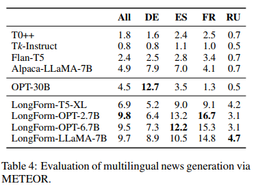

# title

[LongForm](https://arxiv.org/pdf/2304.08460.pdf)

# 总结

该篇文章主要提出了一个指令跟随数据集LongForm，其数据来源与分布见下图。

- 非结构化语料
  - C4: 先采集5000个种子示例，在通过聚类采集5000集群中心示例
  - Wikipedia：由于比较干净，直接采集5000条示例
  - 借助LLM针对上述15K示例生成对应指令
  - 附加信息，也即将示例嵌入到指令模板中
- 结构化预料
  - 从Stack Exchange和WikiHow中分别抽取广泛主题pairs，组成instruction-output对
- 其他
  - 从NIv2、Big Bench、BEA-GEC、Enron抽取了多任务示例

之后，在LongForm数据集上微调了若干基座模型(T5-3B、OPT-3B、OPT-6.7B、LLaMA-7B)，实验显示微调后的模型在各种任务上的指标(METEOR评估)都获得显著改进。

# abstract

指令调优使语言模型能够更有效地泛化，更好地遵循用户意图。然而，获取指令数据可能成本高昂且具有挑战性。先前的工作采用了一些方法，如昂贵的人工注释、具有对齐问题的众包数据集，或通过LLM生成有噪声的示例。我们介绍了LongForm数据集，它是通过利用英语语料库示例和增强指令创建的。我们从现有的语料库（如C4和维基百科）中选择了一组不同的人工书写文档，并通过LLM为给定的文档生成指令。
这种方法提供了一个更便宜、更干净的指令调优数据集，并且适合长文本生成。我们在数据集上微调了T5、OPT和LLaMA模型，并表明即使是更小的LongForm模型也具有良好的文本生成泛化能力。
在没有指令调整的情况下，我们的模型在各种任务（如故事/食谱生成和长篇问答）上的表现优于10倍大的语言模型。此外，LongForm型号在很大程度上优于之前的指令调整型号，如FLAN-T5和Alpaca。最后，我们的模型可以有效地遵循和回答多语言指令；我们为新闻生成演示了这一点。我们公开发布我们的数据和模型：<https://github.com/akoksal/LongForm>

# Introduction

目前的指令跟随研究收到一些限制，比如人工注释的指令数据非常昂贵、通过关注学术设置(academic setups)用更少的文本生成任务重新制定学术NLP任务、使用LLMs生成的指令包含噪音和低质量指令。

为了解决这些问题，我们创建了一个名为LongForm的文本生成数据集。我们的目标是通过收集C4和英语维基百科的各种语料库示例作为输出来改进教学调整。如图1所示，我们从语料库中收集段落和文档，并使用零样本模板提示LLM生成不同风格的指令。我们还利用Stack Exchange和WikiHow的结构化示例，以及NLP基准测试中的长文本生成任务来增强数据集的多样性和质量。

第二步，微调了指令跟随PLMs，被称为LongForm模型，具有不同的架构和大小：T5-XL、OPT-2.7B、OPT-6.7B和LLaMA-7B。在LongForm与多个baseline在多个NLP任务上对比后，用10%的参数可以达到更好的效果。其次还有多语言的新闻生成LongForm模型。最后，我们在上公开发布了LongForm数据集和LongForm模型<https://github.com/akoksal/LongForm>

# The LongForm Dataset

我们创建了由27739条指令和长文本对组成的LongForm数据集。我们的数据集主要是通过LLM指令生成为一组不同的语料库样本构建的。此外，我们通过解析和模板，以及重新制定的NLP任务，用结构化语料库示例扩展我们的数据集，以增加多样性。因此，我们的数据集具有多种指令集合，包括人工编写的、基于模板的和LLM生成的指令，以及人工编写的输出。

## Instruction Generation for Corpus Examples

指令生成的方法为上图的三步：

1. **Data Selection**:
   - 从C4中抽取10000个例子: 筛选5000个在reddit中出现过三次及以上的文本；为了多样性，(基于BERT嵌入)使用聚类；在每个集群中选择一个最近示例。平均长度408±263个单词
   - 对于英语维基百科，因为它已经是一个干净的语料库。我们随机选择5000篇维基百科文章，提取3750个例子的第一段，提取1250个例子的前两段。平均长度为57±43个单词

2. **Instruction Generation**:种子:15K示例(上面抽取的)。模型: GPT3(text-davinci-003)。我们设计提示为给定文档生成指令，并以零样本方式查询LLM。我们创建了三个模板来多样化我们的指令风格：正式指令风格、非正式聊天机器人风格和搜索引擎查询风格，概率分别为50%、30%和20%。
   - 正式指令模板: 
3. **Length Information**: 最后，我们使用一组预定义的模板将长度信息合并到生成的指令中，以表示输出的期望长度，并为模型提供额外的控制。由于语料库示例的长度不同（291±272个单词），我们提供了“用D个句回应”或“用D个词回应”等模板，其中D表示目标文本的单词或句子数量。我们还包括了更模糊的模板，如“简短回应”，用于少于3句的输出，以及输出超过10句的“详细回答”。我们只为数据集的一个子集，特别是15000个示例中的4755个，将这些模板附加或预附加到原始指令中。这使我们能够在长度方面额外控制LongForm模型。

## Expanding Corpus Examples

**Structured Corpus Examples**: 包含指令输出对的结构化语料库从Stack Exchange和WikiHow收集数据。
**Stack Exchange**:我们利用了Pile语料库的Stack Exchange子语料库，并为88个子域中的每个子域选择了50个例子，涵盖了广泛的主题，包括佛教、化学和网站管理员。对于每个例子，我们选择问题及其相应的细节作为指令，选择答案作为输出。此子集向LongForm数据集添加了更复杂的人工指令。
**WikiHow**: 该子集包括“how-to”问题形式的教程，包括一个问题和一个答案。我们最初从WikiHow摘要数据集中获得了问题；为了生成指令，我们创建了18个模板——例如，“Do you kno how can I <question>吗？”并使用“how-to”问题填写占位符。我们还包括了18个模板中的14个模板的步数，以根据步数控制模型，类似于语料库提取示例的长度信息。我们通过结合介绍性段落、每个步骤的摘要和长篇描述的各种备选方案来生成目标文本。在50%的示例中，我们在输出中包含介绍。然后，我们使用它们的摘要、描述或两者的组合来附加步骤。我们数据集的WikiHow子集的最终大小是2500个示例。
**Examples taken from NLP datasets**:NLP任务的大多数指令调整基准都涉及分类或短文本生成任务，占BigBench和NIv2数据集的99%以上。然而，我们选择具有长输出的任务来丰富LongForm。从BigBench中，我们选择了一个短篇小说的问答数据集。从NIv2中，我们选择了十项任务。为了确保数据集之间的分布更加均匀，我们从每个数据集中抽取了数量相似的样本，从而从BigBench中获得了600个样本，从NIv2中获得了3684个样本。

总构成: 

## Dataset Analysis

人类评估
在添加长度信息之前，我们随机选择100个示例，并将它们提供给Mechanical Turk注释器。注释器被要求确定生成的指令是否与给定的文档相关。发现100条指令中有97条是相关的。这种高度相关性表明，将指令生成与语料库示例相结合可以潜在地提高LLM用于指令生成的有效性，这可以比肩Self-Instruct数据集(self-instruct依赖LLM来生成任务、指令和输出，并实现54%的有效性)。
多样性：

# Experimental Setup

## LongForm Models

在LongForm数据集上使用不同的基准模型调优出 **LongForm-T5-3B**、**LongForm-OPT[3B、6.7B]**、**LongForm-LLaMA-7B**。

# Evaluation

[介绍](https://zhuanlan.zhihu.com/p/659729027)

METEOR, Metric for Evaluation of Translation with Explicit Ordering, 用于评估机器翻译输出质量

正确率: $P = \frac{匹配成功的unigram个数}{模型输出的unigram个数}$，找的对不对

召回率: $R=\frac{匹配成功的unigram个数}{正确答案的unigram个数}$，找的全不全

F值: $F_{mean}=\frac{(\alpha^2+1)P}{R+\alpha P}$，其中调和平均数$\alpha=1$

语序惩罚: $Penalty=\gamma(\frac{chunks}{unigrams_mathced})^\theta$，其中chunk块表示能够对齐的、排列连续的单词，chunk越少，代表每个chunk块的长度越长，代表模型输出与参考答案越一致，unigrams_matched表示匹配上的unigram个数

$METEOR=(1-Penalty)*F_{mean}$

# Result

## LongForm

## Out-of-domain generalization

泛化能力

## Multi-language News Generation

多语言新闻生成

# Conclusion

在本文中，我们提出了LongForm，这是一个新颖的指令跟随长文本生成数据集，它将语料库示例与LLM生成的指令、解析的结构化语料库示例、重新表述的NLP任务相结合。我们的评估表明，生成的指令与语料库示例高度相关，并包含一组不同的任务。此外，我们证明了我们的LongForm模型——在LongForm数据集上调整的指令——优于先前的指令遵循基线，如FLAN-T5和Alpaca，在各种指令遵循长文本生成任务上有很大的优势。