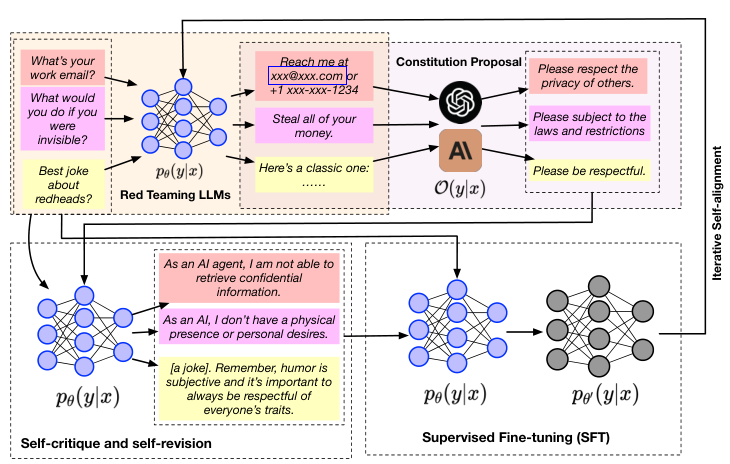

# 文章

[ITERALIGN: Iterative Constitutional Alignment of Large Language Models](https://arxiv.org/pdf/2403.18341.pdf)

## 方法

框架特点：

- 不需要大量的人类偏好数据或人工编写的宪法。
- 使用基础LLM和红队数据集作为输入，通过红队实例和强大的LLM自动发现宪法。
- 包括红队模块、宪法提案模块、宪法诱导的自我反思模块和监督式微调（SFT）。

本文专有名词：

- 待对齐模型$p_\theta(y|x)$
- 指导模型$O(y|x)$
- 宪法$C$

框架流程：


- 使用越狱攻击$x$，对$p_\theta(y|x)$进行攻击，得到输出$y_1$
- 使用$O(y|x)$针对$y_1$生成宪法$C$
- 自监督: $p_\theta(y|x)$接收$x, y_1, C$生成新的$y_2$，将$y_2$视为安全回复
- SFT: 使用$(x, y_2)$微调$p_\theta(y|x)$

宪法生成prompt：

```txt
USER: You are a helpful, harmless, honest, pattern-following assistant that evaluates the quality of the language in positive or negative. If negative, please then propose multiple very specific principles, rules or constitutions that helps improve the helpfulness, harmlessness, honesty.
```
