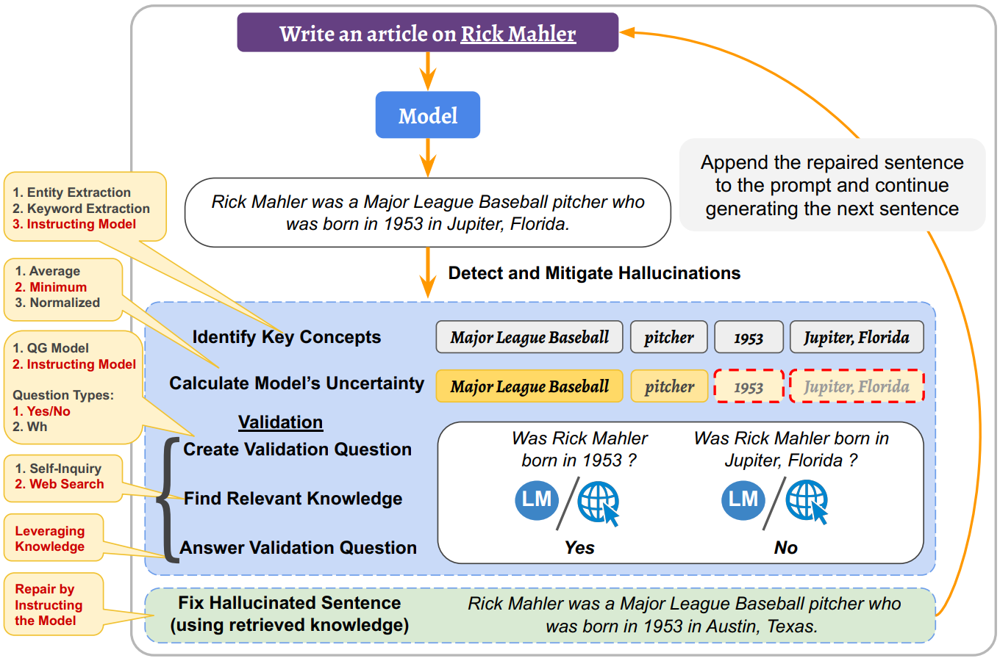

# title

[A Stitch in Time Saves Nine: Detecting and Mitigating Hallucinations of
LLMs by Validating Low-Confidence Generation](https://arxiv.org/abs/2307.03987)

# abstract

问题：LLMs往往会产生“幻觉”，严重阻碍了LLMs的可靠性。在这项工作中，我们解决了这个关键问题，并提出了一种在生成过程中主动检测和缓解幻觉的方法。
方法：具体来说，我们首先利用模型的logit输出值来识别潜在幻觉的候选者，通过验证程序检查其正确性，减轻检测到的幻觉，然后继续生成过程。
效果：检测技术召回率88%，正确检测（真阳性）的幻觉缓解57.6%，且假阳性也不会引入新幻觉、GPT3.5模型的幻觉平均从47%减到14.5%。

# Instruction

LLMs的生成幻觉的趋向影响到其可靠性并且限制了其在真实世界中的应用。

本论文聚焦于解决LLMs的幻觉问题。

本文的方法见下图所示：

- **hallucination detection**：
  - identify key concepts
  - calculate model's uncertainty
  - validation:
    - create validation question
    - find relevant knowledge
    - answer validation question
- **hallucination mitigation**：
  - repair the hallucinated sentence

检测技术召回率88%;
修复成功率57.6%

# Approach

## Hallucination detection

### Indentify key concepts

**Entity Extraction**: 使用现成的实体提取模型来检测观点。缺点是部分观点非实体，使用key-word extraction技术解决。

**Keyword extraction**：同样是[现成工具](https://huggingface.co/ml6team/keyphrase-extraction-kbir-kpcrowd)在KPCrowd dataset数据集上微调KBIR得到的模型。

**\*Instructing the Model\***:使用语言模型来检测concepts

### Calculate Model‘s Uncertainty

针对提供概率输出的模型，可以通过概率值判断不确定性。值得注意的是，计算不确定性并不是幻觉检测中必需的步骤。

一个观念是由多个token组成的。（大模型中单词通常会被tokenizer分解成若干token，因此concept由多个token组成），假如这n个token的概率分别是$p_1,p_2,...,p_n$。本文提出了三种计算concept置信度的方法：
**Average of Token Probabilities**：$score=AVG(p_1,p_2,...,p_n)$
**Normalized Product of Token Probabilities**:$score=(p_1\times p_2\times...\times p_n)^{\frac{1}{n}}$
**\* Minimum of Token Probabilities\***:$score=MIN(p_1,p_2,...,p_n)$

考虑到平均值与标准化会减弱不平衡的影响，因此最小值更能判断观点的不确定性。需要注意的是，score仅仅是判断换觉得一个信号，并不能为存在幻觉提供保障。对于不提供logit输出值的模型，可以将所有或一些启发式选择的概念（取决于系统的计算和延迟预算）传递到验证阶段，用于检测幻觉。

### Create Validation Question

**Question Generation Tool**：现成的问题生成工具
**\*Instructing the Model\***：指示语言模型创建验证问题。

除Yse/No问题，Wh(What/Why/Where等)问题也可以起作用。

### Find Relevant knowledge

**\*Web Search\***：利用搜索API进行验证。
**Self-Inquiry**:将问题直接给语言模型来验证。

### Answer Validation Question

提示模型回复问题并验证回复。

## Hallucination mitigation

提示模型通过借用重新检索到的知识作为凭证来移除或替换幻觉信息以修复回答。