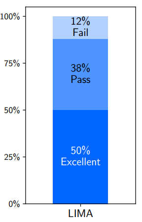
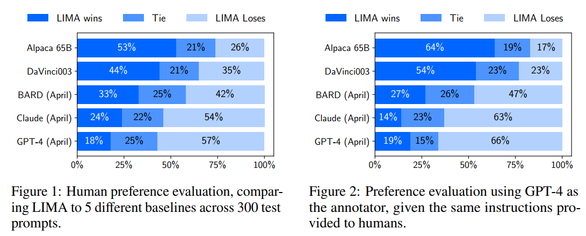
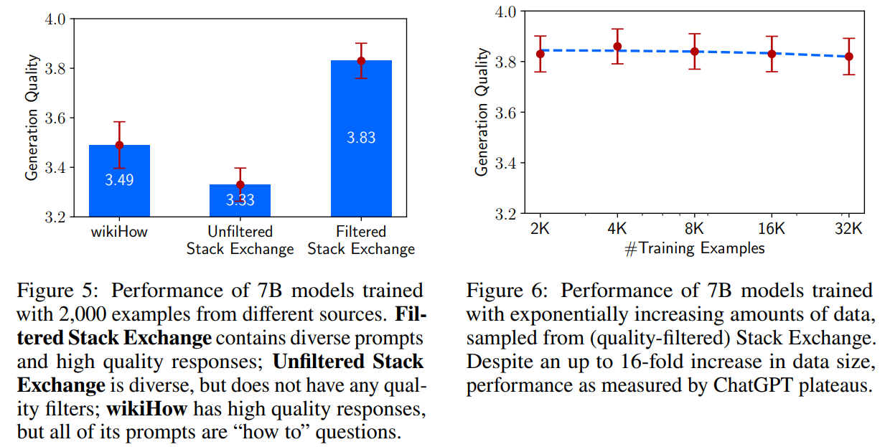
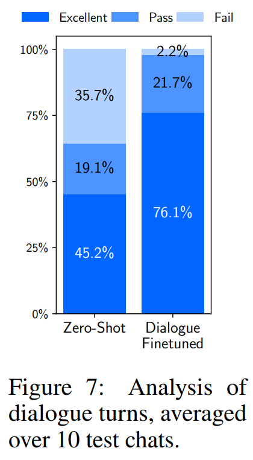

# title

[LIMA: Less Is More for Alignment](https://arxiv.org/pdf/2305.11206.pdf)

# 总结

思想：LIMA认为，LLMs在pre-train阶段就已经学到了几乎全部的知识，对齐阶段主要学习交互风格。基于该假设，LIMA认为对齐阶段不承担学习知识的任务，所以不需要大量样本，只需要少量高质量样本微调就可以达到对齐的目的。

数据：准备了一千条样本数据，其中750条来自于社区论坛Stack Exchange、wikiHow、Pushshift Reddit Dataset，250条来自人工创作。

- 实验1：绝对评估：通过人工和GPT4进行质量评估，有38%的pass、50%的excellent和12%的fail

- 实验2：对比实验：与Alpaca 65B、OpenAI DaVinci003、Google Bard、Anthropic Claude、OpenAI GPT-4分别有人工和GPT-4进行评估，LIMA能够几百Alpaca 65B和DaVinci003，尽管他们数据量远多于LIMA

- 实验3：消融实验：多样性和数据质量对模型影响巨大，而数据量影响不明显

- 实验4：多轮对话能立：通过30个多轮对话样本进行微调后大幅提升了多轮对话能力。进一步支持了LIMA的假设。

**总结**
本工作通过精心构造高质量的小数据集对大模型进行微调，从而获得了以下几个结论：

- LLM 的几乎全部能力在预训练阶段获得
- 微调使模型学习到交互的风格与方式
- 可以通过小规模的优质数据进行高效对齐

**何为优质数据？**

- prompt多样
- response风格统一
- prompt和response的回答文本质量高

最后，文章还讨论了这种微调方式的不足之处。

- 构造优质数据耗费心智，规模难以扩展
- 不满足企业级的健壮性标准
